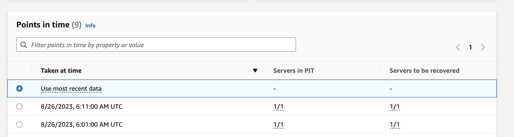

### 1차 Test - /boot/post_launch에서 s1.sh, s2.sh 저장 후 Test

```
### Source
root@ip-10-100-27-75:/boot/post_launch# ls -arlt
total 16
drwxr-xr-x 6 root root 4096 Aug 26 05:59 ..
-rwxr--r-- 1 root root   19 Aug 26 06:00 s1.sh
-rwxr--r-- 1 root root   26 Aug 26 06:12 s2.sh
drwxr-xr-x 2 root root 4096 Aug 26 06:12 .
root@ip-10-100-27-75:/boot/post_launch# cat s1.sh s2.sh 
touch /root/s1.txt
touch /root/s2.txt
```


```
### New Instance by DRS
root@ip-10-100-5-52:~# ls -alrt

-rw-r--r--  1 root root    0 Aug 26 06:10 s2.txt
-rw-r--r--  1 root root    0 Aug 26 06:10 s1.txt
```


---

### 2차 Test - /etc/hosts에서 sed를 이용한 string replace

```
### Source Server
root@ip-10-100-27-75:~# cat /etc/hosts |grep ONPREM
10.100.18.51    ONPREM-DB1

root@ip-10-100-27-75:/boot/post_launch# ls
dr.sh  s1.sh  s2.sh
root@ip-10-100-27-75:/boot/post_launch# cat dr.sh 
sed -i 's/10.100.18.51/10.100.16.159/g' /etc/hosts

```


```
### New Instance by DRS
root@ip-10-100-27-75:/boot/post_launch# date
Sat Aug 26 06:18:17 UTC 2023

root@ip-10-100-10-199:~# cat /etc/hosts |grep ONPREM
10.100.16.159   ONPREM-DB1
```




```
root@ip-10-100-10-199:~# ls -alrt s*.txt
-rw-r--r-- 1 root root 3 Aug 26 06:26 s2.txt
-rw-r--r-- 1 root root 0 Aug 26 06:26 s1.txt
root@ip-10-100-10-199:~# cat s2.txt 
s2
```


---

### 3차 Test - network configuration file & network restart


```
### Source
root@ip-10-100-27-75:/etc/netplan# cat 50-cloud-init.yaml 
# This file is generated from information provided by the datasource.  Changes
# to it will not persist across an instance reboot.  To disable cloud-init's
# network configuration capabilities, write a file
# /etc/cloud/cloud.cfg.d/99-disable-network-config.cfg with the following:
# network: {config: disabled}
network:
    ethernets:
        ens5:
            dhcp4: true
            dhcp6: false
            match:
                macaddress: 06:f9:98:ee:50:b0
            set-name: ens5
    version: 2
    
root@ip-10-100-27-75:/boot/post_launch# cat dr2.sh 
sed -i 's/macaddress/\#macaddress/g' /etc/netplan/50-cloud-init.yaml 
netplan apply
systemctl restart systemd-networkd
```


```
### New Instance by DRS
root@ip-10-100-11-119:~# ls -alrt s*.txt
-rw-r--r-- 1 root root 3 Aug 26 07:00 s2.txt
-rw-r--r-- 1 root root 0 Aug 26 07:00 s1.txt

root@ip-10-100-11-119:~# cat /etc/netplan/50-cloud-init.yaml 
# This file is generated from information provided by the datasource.  Changes
# to it will not persist across an instance reboot.  To disable cloud-init's
# network configuration capabilities, write a file
# /etc/cloud/cloud.cfg.d/99-disable-network-config.cfg with the following:
# network: {config: disabled}
network:
    ethernets:
        ens5:
            dhcp4: true
            dhcp6: false
            match:
                #macaddress: 02:52:16:18:b6:30
            set-name: ens5
    version: 2
```


---

### 4차 Test - network configuration file 수정 & Network restart


```
### Source
root@ip-10-100-27-75:/etc/netplan# cat 50-cloud-init.yaml 
# This file is generated from information provided by the datasource.  Changes
# to it will not persist across an instance reboot.  To disable cloud-init's
# network configuration capabilities, write a file
# /etc/cloud/cloud.cfg.d/99-disable-network-config.cfg with the following:
# network: {config: disabled}
network:
    ethernets:
        ens5:
            dhcp4: true
            dhcp6: false
            match:
                macaddress: 06:f9:98:ee:50:b0
            set-name: ens5
    version: 2
    
root@ip-10-100-27-75:/boot/post_launch# cat dr2.sh 
sed -i 's/macaddress/\#macaddress/g' /etc/netplan/50-cloud-init.yaml 
```

