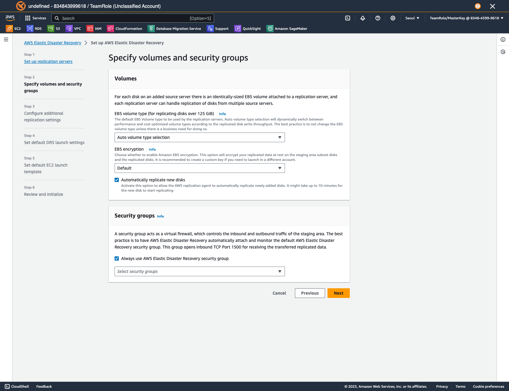

# AWS Elastic Disaster Recovery Basic Guide

## DRS 초기 설정 및 기본 사용 방법

---

### Replication Server 설정

1. **Configure and initialize**

2. **Set up replication servers**

---

3. **Volume Setup**

---

4. **IP Setup, Network QOS, PIT**

---

5. **Set default DRS launch settings**

---

6. **Default EC2 Launch Template**

---

7. **Configuration Review**

---

