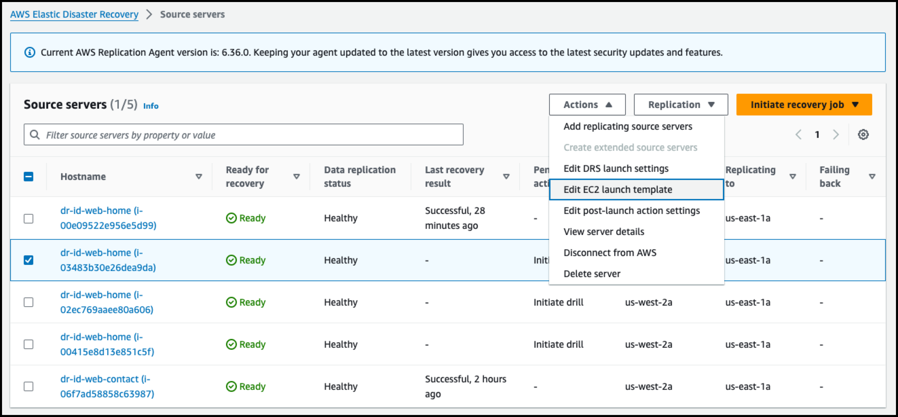
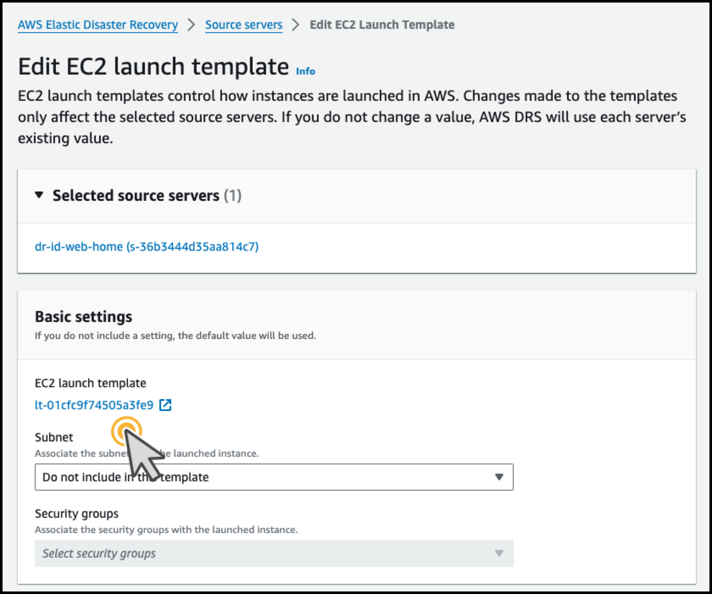
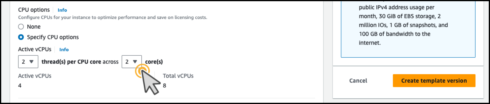
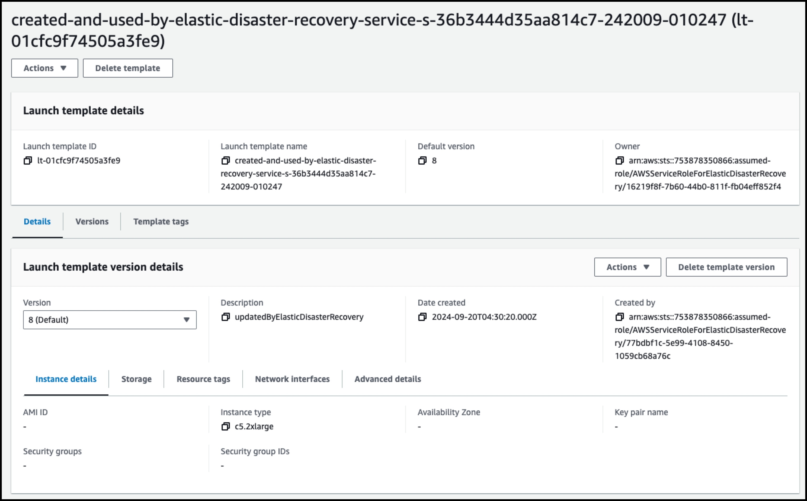
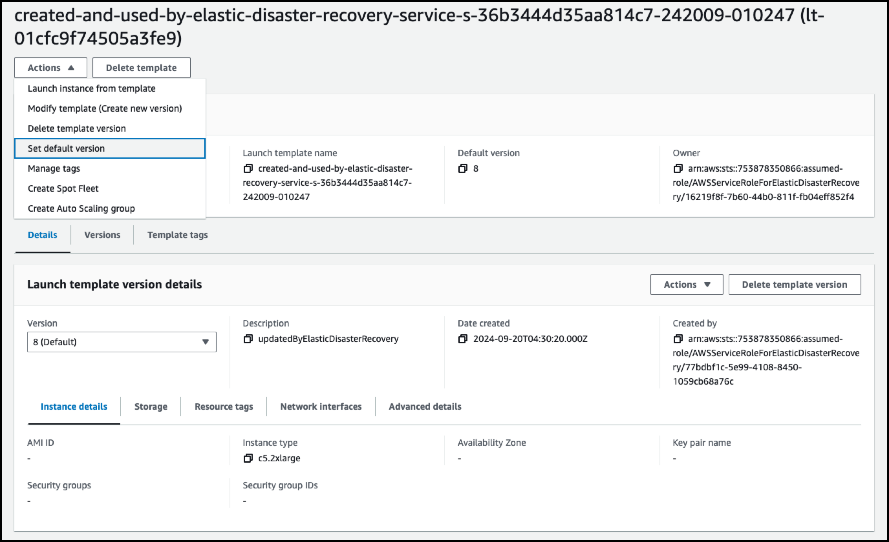
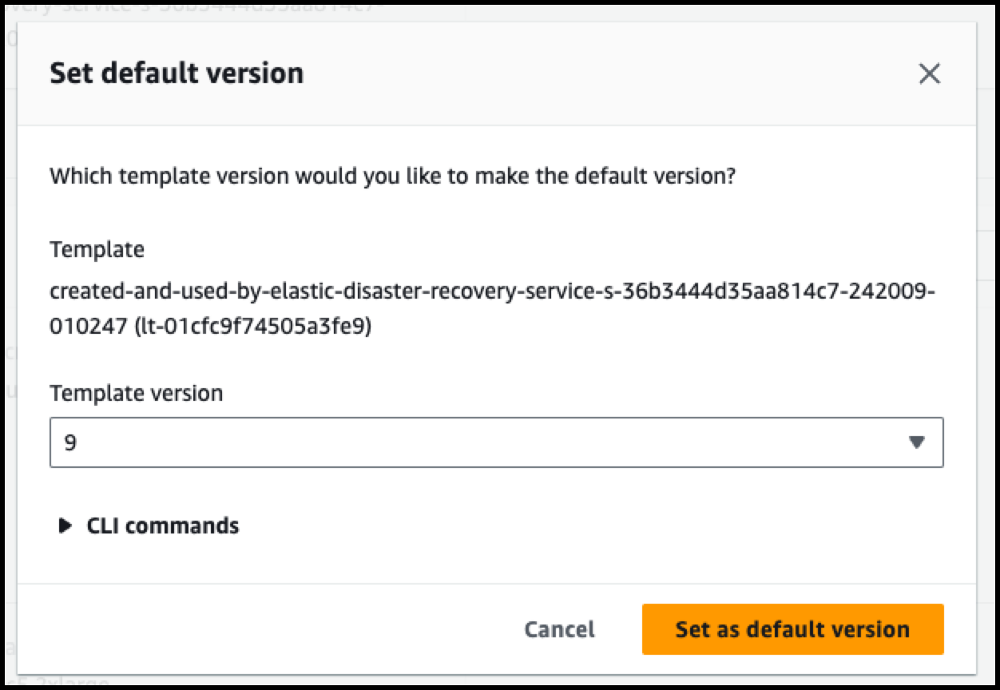
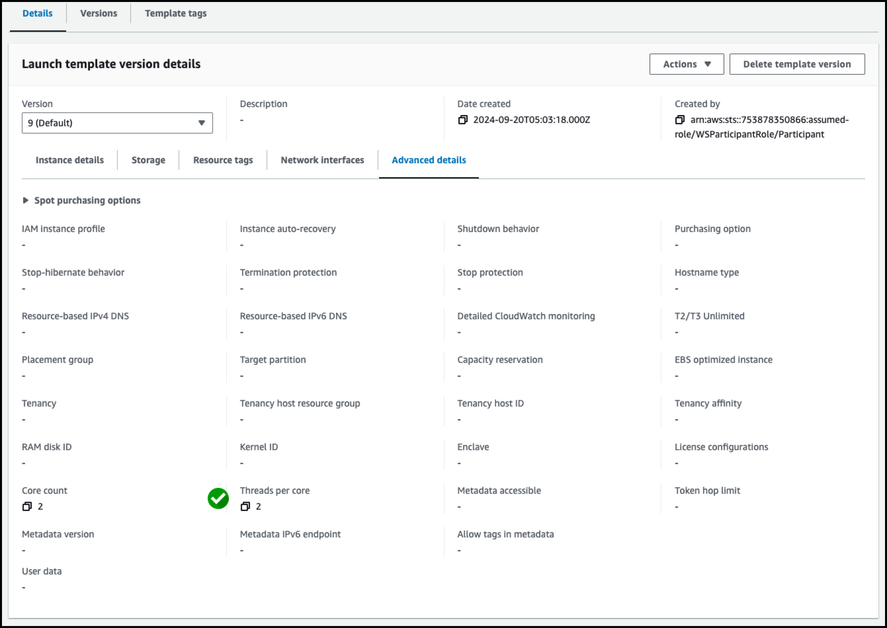
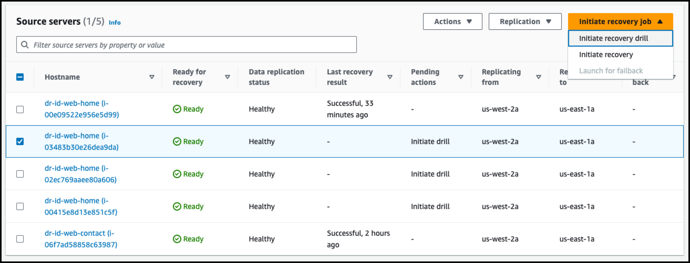
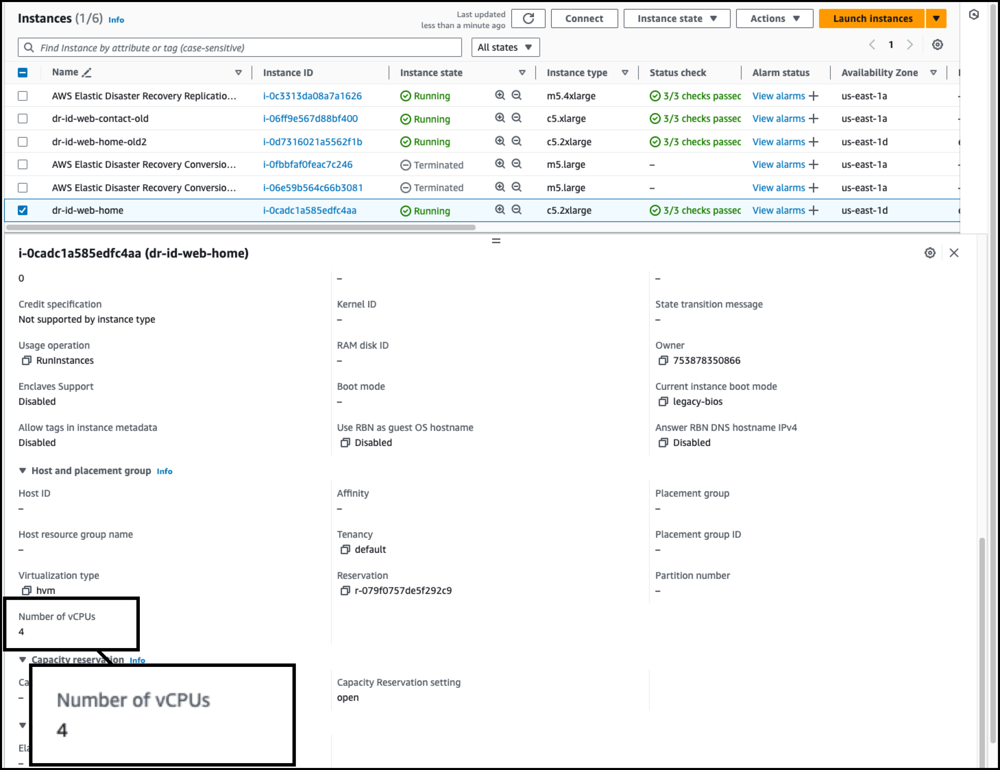

# 1. Failover시 DR Site CPU Core Options(Factor) 적용 방법


### 1. Source Server => Actions => Edit EC2 launch template 




---

### 2. Source Server에 Assign된 EC Launch Template 확인




---

### 3. Template에서 Advanced Option => Cpu options 수정 => Create Template Version




---

### 4. 새로운 Template Version으로 Default Version Update










---

### 5. Template에서 Threads per core 확인




---

### 6. Failover Drill Test 실행 




---

### 7. Failover 후 CPU Factor 확인




```
sh-4.2$ cat /proc/cpuinfo |grep 'core id'
core id         : 0
core id         : 1
core id         : 0
core id         : 1
```


