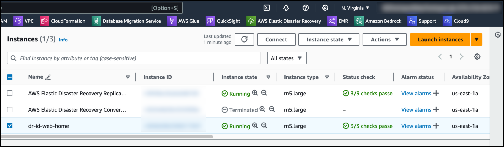

# 2. Launch시 DR Site용 /etc/fstab 수정 방법(EFS 등)


```
여기에서는 다음의 3가지 시나리오를 검증하며, 각 방법을 구현하는 방법을 기술합니다.
자동화를 위하여 최대한 CLI와 SDK를 활용하였습니다.

Source Region : us-west-2
Target Region : us-east-1

Scenario 1 : 기존 EFS 정보를 /etc/fstab에서 주석문처리
- 가장 기본이 되는 내용이며, Source에서 사용하던 EFS를 /boot/post_launch/efs-commented.sh을 이용하여, /etc/fstab에서 해당 entry를 주석문 처리하여 정상적으로 Failover하는 방법

Scenario 2 : DR Failover시 자동으로 Target 쪽에서 EFS가 Mount 설정
- Source to Target Failover 발생 시 us-west-2에서 사용하던 EFS대신, us-east-1(Target)의 EFS로 mount되도록 /boot/post_launch/efs-change.sh을 이용하여, /etc/fstab을 수정하고, Target instance launch시 자동으로 Target EC2에서 mount되는 방법

Scenario 3 : EFS를 DataSync로 동기화 후 DR Failover 후 정상인지 확인
- Source EFS와 Target EFS를 Data Sync로 동기화하고, Failover시 2의 시나리오처럼 Target Instance launch시 자동으로 Target EFS가 mount되는 방법

```


## Scenario 1 : 기존 EFS 정보를 /etc/fstab에서 주석문처리

```
Source Region : Oregon us-west-2
Target Region : Virginia us-east-1
```


### 1. EFS 생성 및 Source EC2에 Mount (Source)

### 다음의 변수들을 수정 필요

```
VPC_ID="vpc-0e7536971adbad31f"  # 사용할 VPC의 ID
EFS_NAME="efs-us-west-2-web"   # 생성할 EFS의 이름
REGION="us-west-1"              # 사용할 AWS 리전 (미국 동부)
SECURITY_GROUP_NAME="web-source-security-group" # 보안 그룹 이름
```


```
#!/bin/bash

# 변수 설정
VPC_ID="vpc-037583408fac9602d"
EFS_NAME="efs-us-west-2-web"
REGION="us-west-2" # 미국 서부(오레곤) 리전
SECURITY_GROUP_NAME="web-source-security-group" # 보안 그룹 이름

# 보안 그룹 ID 가져오기
SECURITY_GROUP_ID=$(aws ec2 describe-security-groups --filters "Name=group-name,Values=$SECURITY_GROUP_NAME" --query "SecurityGroups[0].GroupId" --output text --region $REGION)

if [ -z "$SECURITY_GROUP_ID" ]; then
  echo "보안 그룹 ID를 찾을 수 없습니다!"
  exit 1
fi

echo "Security Group ID: $SECURITY_GROUP_ID"

# 1. Private Subnet ID 가져오기
PRIVATE_SUBNET_IDS=$(aws ec2 describe-subnets --filters "Name=vpc-id,Values=$VPC_ID" "Name=tag:aws:cloudformation:logical-id,Values=PrivateSubnet*" --query "Subnets[].SubnetId" --output text --region $REGION)

if [ -z "$PRIVATE_SUBNET_IDS" ]; then
  echo "Private Subnet을 찾을 수 없습니다!"
  exit 1
fi

echo "Private Subnet IDs: $PRIVATE_SUBNET_IDS"

# 2. EFS 생성
EFS_ID=$(aws efs create-file-system --creation-token $EFS_NAME --tags Key=Name,Value=$EFS_NAME --query "FileSystemId" --output text --region $REGION)

echo "EFS ID: $EFS_ID"

# 3. EFS가 available 상태가 될 때까지 대기
echo "EFS가 available 상태가 될 때까지 대기 중..."
while true; do
  EFS_STATE=$(aws efs describe-file-systems --file-system-id $EFS_ID --query "FileSystems[0].LifeCycleState" --output text --region $REGION)
  if [ "$EFS_STATE" == "available" ]; then
    echo "EFS가 available 상태가 되었습니다."
    break
  fi
  echo "현재 상태: $EFS_STATE. 10초 후 다시 확인합니다."
  sleep 10
done

# 4. 각 Private Subnet에 대해 Mount Target 생성
for SUBNET_ID in $PRIVATE_SUBNET_IDS; do
  echo "Subnet $SUBNET_ID에 Mount Target 생성 중..."
  aws efs create-mount-target --file-system-id $EFS_ID --subnet-id $SUBNET_ID --security-groups $SECURITY_GROUP_ID --region $REGION
done

echo "EFS 생성 및 Mount Target 설정 완료."

# 5. Security Group 수정 (필요한 경우)
# EFS에 접근할 수 있도록 NFS 트래픽을 허용해야 합니다.
aws ec2 authorize-security-group-ingress --group-id $SECURITY_GROUP_ID --protocol tcp --port 2049 --source-group $SECURITY_GROUP_ID --region $REGION

echo "Security Group $SECURITY_GROUP_ID에 NFS 포트(2049) 접근 허용 완료."

# 6. EFS 마운트 명령어 출력
# 생성된 EFS를 마운트할 수 있는 명령어를 출력
echo "EFS를 마운트하려면 다음 명령어를 사용하세요:"
echo "sudo mount -t efs -o tls $EFS_ID:/ /mnt/efs"

# 마운트 포인트 디렉토리 생성 (필요한 경우)
echo "마운트 포인트 디렉토리가 없다면 다음 명령어로 생성하세요:"
echo "sudo mkdir -p /mnt/efs"
```


### 2. EC2에 EFS Util 설치 (Source)

```
sudo yum install -y amazon-efs-utils
```


### 3. Mount Point 생성 및 Mount Test (Source) - 위에 Log에서 Command 확인

```
sudo mount -t efs -o tls fs-091fcc775883cdb03:/ /mnt/efs

sh-4.2$ sudo mount -t efs -o tls fs-091fcc775883cdb03:/ /mnt/efs
sh-4.2$ df -h /mnt/efs
Filesystem      Size  Used Avail Use% Mounted on
127.0.0.1:/     8.0E     0  8.0E   0% /mnt/efs
```


### 4. /etc/fstab 수정 및 Test (Source)

```
sh-4.2$ sudo vi /etc/fstab
sh-4.2$ cat /etc/fstab
#
UUID=9f262948-b373-4d6f-b453-2a05174e900c     /           xfs    defaults,noatime  1   1
fs-091fcc775883cdb03:/ /mnt/efs efs _netdev,tls 0 0

sh-4.2$ sudo umount /mnt/efs
sh-4.2$ df -h /mnt/efs
Filesystem      Size  Used Avail Use% Mounted on
/dev/nvme0n1p1  8.0G  2.2G  5.8G  28% /

sh-4.2$ sudo mount /mnt/efs3
sh-4.2$ df -h /mnt/efs3
Filesystem      Size  Used Avail Use% Mounted on
127.0.0.1:/     8.0E     0  8.0E   0% /mnt/efs3
```


### 5. Target 쪽 EFS 생성 (Target)

### 다음의 변수들을 수정 필요

```
VPC_ID="vpc-01cb2196106db5cf9"  # 사용할 VPC의 ID
EFS_NAME="efs-us-east-1-web2"   # 생성할 EFS의 이름
REGION="us-east-1"              # 사용할 AWS 리전 (미국 동부)
SECURITY_GROUP_NAME="web-target-security-group" # 보안 그룹 이름
```


````
#!/bin/bash

# 변수 설정
VPC_ID="vpc-01cb2196106db5cf9"
EFS_NAME="efs-us-east-1-web"
REGION="us-east-1" # 미국 서부(오레곤) 리전
SECURITY_GROUP_NAME="web-target-security-group" # 보안 그룹 이름

# 보안 그룹 ID 가져오기
SECURITY_GROUP_ID=$(aws ec2 describe-security-groups --filters "Name=group-name,Values=$SECURITY_GROUP_NAME" --query "SecurityGroups[0].GroupId" --output text --region $REGION)

if [ -z "$SECURITY_GROUP_ID" ]; then
  echo "보안 그룹 ID를 찾을 수 없습니다!"
  exit 1
fi

echo "Security Group ID: $SECURITY_GROUP_ID"

# 1. Private Subnet ID 가져오기
PRIVATE_SUBNET_IDS=$(aws ec2 describe-subnets --filters "Name=vpc-id,Values=$VPC_ID" "Name=tag:aws:cloudformation:logical-id,Values=PrivateSubnet*" --query "Subnets[].SubnetId" --output text --region $REGION)

if [ -z "$PRIVATE_SUBNET_IDS" ]; then
  echo "Private Subnet을 찾을 수 없습니다!"
  exit 1
fi

echo "Private Subnet IDs: $PRIVATE_SUBNET_IDS"

# 2. EFS 생성
EFS_ID=$(aws efs create-file-system --creation-token $EFS_NAME --tags Key=Name,Value=$EFS_NAME --query "FileSystemId" --output text --region $REGION)

echo "EFS ID: $EFS_ID"

# 3. EFS가 available 상태가 될 때까지 대기
echo "EFS가 available 상태가 될 때까지 대기 중..."
while true; do
  EFS_STATE=$(aws efs describe-file-systems --file-system-id $EFS_ID --query "FileSystems[0].LifeCycleState" --output text --region $REGION)
  if [ "$EFS_STATE" == "available" ]; then
    echo "EFS가 available 상태가 되었습니다."
    break
  fi
  echo "현재 상태: $EFS_STATE. 10초 후 다시 확인합니다."
  sleep 10
done

# 4. 각 Private Subnet에 대해 Mount Target 생성
for SUBNET_ID in $PRIVATE_SUBNET_IDS; do
  echo "Subnet $SUBNET_ID에 Mount Target 생성 중..."
  aws efs create-mount-target --file-system-id $EFS_ID --subnet-id $SUBNET_ID --security-groups $SECURITY_GROUP_ID --region $REGION
done

echo "EFS 생성 및 Mount Target 설정 완료."

# 5. Security Group 수정 (필요한 경우)
# EFS에 접근할 수 있도록 NFS 트래픽을 허용해야 합니다.
aws ec2 authorize-security-group-ingress --group-id $SECURITY_GROUP_ID --protocol tcp --port 2049 --source-group $SECURITY_GROUP_ID --region $REGION

echo "Security Group $SECURITY_GROUP_ID에 NFS 포트(2049) 접근 허용 완료."

# 6. EFS 마운트 명령어 출력
# 생성된 EFS를 마운트할 수 있는 명령어를 출력
echo "EFS를 마운트하려면 다음 명령어를 사용하세요:"
echo "sudo mount -t efs -o tls $EFS_ID:/ /mnt/efs"

# 마운트 포인트 디렉토리 생성 (필요한 경우)
echo "마운트 포인트 디렉토리가 없다면 다음 명령어로 생성하세요:"
echo "sudo mkdir -p /mnt/efs"
````


```
EFS를 마운트하려면 다음 명령어를 사용하세요:

sudo mount -t efs -o tls fs-043a960ee2abd96f0:/ /mnt/efs
```


### 6. Source EC2의 /boot/post_launch script 생성 (Source)

**기존 /etc/fstab 확인**

```
[root@dr-id-web-home post_launch]# cat /etc/fstab
#
UUID=9f262948-b373-4d6f-b453-2a05174e900c     /           xfs    defaults,noatime  1   1
fs-009c39b1aa38353f5:/ /mnt/efs efs _netdev,tls 0 0
```


**Post Script efs-commented.sh 생성 및 실행**

```
[root@dr-id-web-home ~]# cd /boot/post_launch/
[root@dr-id-web-home post_launch]# pwd
/boot/post_launch

[root@dr-id-web-home post_launch]# echo "sed -i '/^fs-009c39b1aa38353f5:/ s/^/# /' /etc/fstab" > efs-commented.sh
[root@dr-id-web-home post_launch]# chmod u+x efs-commented.sh


[root@dr-id-web-home post_launch]# ./efs-commented.sh
[root@dr-id-web-home post_launch]# cat /etc/fstab
#
UUID=9f262948-b373-4d6f-b453-2a05174e900c     /           xfs    defaults,noatime  1   1
# fs-009c39b1aa38353f5:/ /mnt/efs efs _netdev,tls 0 0


[root@dr-id-web-home post_launch]# cat efs-commented.sh
sed -i '/^fs-0680af52cd2b8bda6:/ s/^/# /' /etc/fstab
```


### 7. Drill Test 

```
#!/bin/bash

# 1. 환경 변수 설정
export REGION="us-east-1"  # 사용할 AWS 리전

# 2. DRS에서 Source Server의 List 확인
echo "DRS에서 소스 서버 목록을 가져오는 중..."
SOURCE_SERVERS=$(aws drs describe-source-servers --region $REGION --query "items[].{SourceServerID:sourceServerID, Hostname:sourceProperties.identificationHints.hostname, InstanceID:sourceProperties.identificationHints.instanceId}" |jq)

if [ -z "$SOURCE_SERVERS" ]; then
  echo "소스 서버를 찾을 수 없습니다!"
  exit 1
fi

echo "소스 서버 목록:"
echo "$SOURCE_SERVERS"

# 3. Source Server ID 입력 받기
read -p "복구할 소스 서버의 Source Server ID를 입력하세요: " SERVER_ID

# 4. Initiate recovery 또는 Initiate recovery Drill 선택
echo "복구 유형을 선택하세요:"
echo "1) Initiate Recovery"
echo "2) Initiate Recovery Drill"
read -p "선택 (1 또는 2): " RECOVERY_TYPE

# 선택에 따라 AWS CLI 명령 실행
case $RECOVERY_TYPE in
  1)
    echo "Initiating Recovery for server $SERVER_ID..."
    aws drs start-recovery --source-servers "sourceServerID=$SERVER_ID" --region $REGION --no-is-drill
    ;;
  2)
    echo "Initiating Recovery Drill for server $SERVER_ID..."
    aws drs start-recovery --source-servers "sourceServerID=$SERVER_ID" --region $REGION --is-drill
    ;;
  *)
    echo "잘못된 선택입니다. 스크립트를 종료합니다."
    exit 1
    ;;
esac


echo "작업이 완료되었습니다."
```


### 8. Drill 결과 확인 (post launch 성공)




```
sh-4.2$ df -h
Filesystem      Size  Used Avail Use% Mounted on
devtmpfs        3.8G     0  3.8G   0% /dev
tmpfs           3.8G     0  3.8G   0% /dev/shm
tmpfs           3.8G  332K  3.8G   1% /run
tmpfs           3.8G     0  3.8G   0% /sys/fs/cgroup
/dev/nvme0n1p1  8.0G  2.3G  5.8G  28% /
sh-4.2$ cd /boot/post_launch/
sh-4.2$ ls -alrt
total 12
-rwxr-xr-x 1 root root 2541 Sep  7 08:37 post_launch_script.sh
-rwxr--r-- 1 root root   53 Sep  8 14:35 efs-commented.sh
drwxr-xr-x 2 root root   59 Sep  8 14:35 .
dr-xr-xr-x 6 root root 4096 Sep  8 15:12 ..
sh-4.2$ uptime
 15:15:17 up 2 min,  0 users,  load average: 0.07, 0.05, 0.01
sh-4.2$ cat /etc/fstab
#
UUID=9f262948-b373-4d6f-b453-2a05174e900c       /       xfs     defaults,noatime        0       0
# fs-0680af52cd2b8bda6:/        /mnt/efs3       efs     _netdev,tls     0       0
sh-4.2$
```


**Drill 시 정상적으로 Target Region에서 Instance 가 올라옴을 확인**


## Scenario 2 : DR Failover시 자동으로 Target 쪽에서 EFS가 Mount 설정


---

### 1. us-east-1으로 DR Failover후 자동 EFS Mount 확인

**Source - us-west-2 EFS** :  `fs-091fcc775883cdb03` 

**Target - us-east-1 EFS** : ` fs-0a8cfbea6fe0eebac`


### 2. Source EC2의 /boot/post_launch script 생성 (Source)

**기존 /etc/fstab 확인**

```
[root@dr-id-web-home post_launch]# cat /etc/fstab
#
UUID=9f262948-b373-4d6f-b453-2a05174e900c     /           xfs    defaults,noatime  1   1
fs-091fcc775883cdb03:/ /mnt/efs efs _netdev,tls 0 0

[root@dr-id-web-home post_launch]# df -h /mnt/efs
Filesystem      Size  Used Avail Use% Mounted on
127.0.0.1:/     8.0E     0  8.0E   0% /mnt/efs
```


**Post Script efs-commented.sh 생성 및 실행**

```
[root@dr-id-web-home ~]# cd /boot/post_launch/
[root@dr-id-web-home post_launch]# pwd
/boot/post_launch

[root@dr-id-web-home post_launch]# echo "sed -i 's/fs-091fcc775883cdb03/fs-0a8cfbea6fe0eebac/g' /etc/fstab" > efs-failover.sh

[root@dr-id-web-home post_launch]# cat efs-failover.sh
sed -i 's/fs-091fcc775883cdb03/fs-0a8cfbea6fe0eebac/g' /etc/fstab

[root@dr-id-web-home post_launch]# chmod u+x efs-failover.sh
```


**/etc/fstab backup후 Script Test, 그리고 원복**

```[root@dr-id-web-home post_launch]# cp /etc/fstab ~
[root@dr-id-web-home post_launch]# cp /etc/fstab ~
[root@dr-id-web-home post_launch]# ./efs-failover.sh
[root@dr-id-web-home post_launch]# diff ~/fstab /etc/fstab
3c3
< fs-091fcc775883cdb03:/ /mnt/efs efs _netdev,tls 0 0
---
> fs-0a8cfbea6fe0eebac:/ /mnt/efs efs _netdev,tls 0 0

[root@dr-id-web-home post_launch]# cp ~/fstab /etc/fstab
cp: overwrite ‘/etc/fstab’? y

[root@dr-id-web-home post_launch]# cat /etc/fstab
#
UUID=9f262948-b373-4d6f-b453-2a05174e900c     /           xfs    defaults,noatime  1   1
fs-091fcc775883cdb03:/:/ /mnt/efs efs _netdev,tls 0 0
```


### 3. Drill Script 생성

```
(base) kiwony@kiwonymac.com:/Users/kiwony/temp> cat drill.sh
#!/bin/bash

# 1. 환경 변수 설정
export REGION="us-east-1"  # 사용할 AWS 리전

# 2. DRS에서 Source Server의 List 확인
echo "DRS에서 소스 서버 목록을 가져오는 중..."
SOURCE_SERVERS=$(aws drs describe-source-servers --region $REGION --query "items[].{SourceServerID:sourceServerID, Hostname:sourceProperties.identificationHints.hostname, InstanceID:sourceProperties.identificationHints.instanceId}" |jq)

if [ -z "$SOURCE_SERVERS" ]; then
  echo "소스 서버를 찾을 수 없습니다!"
  exit 1
fi

echo "소스 서버 목록:"
echo "$SOURCE_SERVERS"

# 3. Source Server ID 입력 받기
read -p "복구할 소스 서버의 Source Server ID를 입력하세요: " SERVER_ID

# 4. Initiate recovery 또는 Initiate recovery Drill 선택
echo "복구 유형을 선택하세요:"
echo "1) Initiate Recovery"
echo "2) Initiate Recovery Drill"
read -p "선택 (1 또는 2): " RECOVERY_TYPE

# 선택에 따라 AWS CLI 명령 실행
case $RECOVERY_TYPE in
  1)
    echo "Initiating Recovery for server $SERVER_ID..."
    aws drs start-recovery --source-servers "sourceServerID=$SERVER_ID" --region $REGION --no-is-drill |jq
    ;;
  2)
    echo "Initiating Recovery Drill for server $SERVER_ID..."
    aws drs start-recovery --source-servers "sourceServerID=$SERVER_ID" --region $REGION --is-drill |jq
    ;;
  *)
    echo "잘못된 선택입니다. 스크립트를 종료합니다."
    exit 1
    ;;
esac


echo "작업이 완료되었습니다."
```


### 4. Drill 테스트 실행

```
(base) kiwony@kiwonymac.com:/Users/kiwony/temp> ./drill.sh
DRS에서 소스 서버 목록을 가져오는 중...
소스 서버 목록:
[
  {
    "SourceServerID": "s-38080166ff98a8fc1",
    "Hostname": "dr-id-web-home",
    "InstanceID": null
  },
  {
    "SourceServerID": "s-33e59ebbae875809f",
    "Hostname": "dr-id-web-contact",
    "InstanceID": null
  },
  {
    "SourceServerID": "s-32c734b5ce47c6326",
    "Hostname": "dr-id-web-home",
    "InstanceID": null
  }
]
복구할 소스 서버의 Source Server ID를 입력하세요: s-32c734b5ce47c6326
복구 유형을 선택하세요:
1) Initiate Recovery
2) Initiate Recovery Drill
선택 (1 또는 2): 2
Initiating Recovery Drill for server s-32c734b5ce47c6326...
작업이 완료되었습니다.
```


### 5. Drill 상태 조회 Script (drill-status.py)

```
import boto3
import time

def list_recovery_jobs(region):
    client = boto3.client('drs', region_name=region)
    try:
        response = client.describe_jobs()
        jobs = response.get('items', [])
        print("Recovery Jobs in Region:", region)
        for job in jobs:
            print(f"Job ID: {job['jobID']}, Status: {job['status']}")
    except Exception as e:
        print(f"Error listing recovery jobs: {e}")

def get_job_status(job_id, region):
    client = boto3.client('drs', region_name=region)
    try:
        response = client.describe_jobs(
            filters={
                'jobIDs': [job_id]
            }
        )
        job = response['items'][0]
        return job['status']
    except Exception as e:
        print(f"Error retrieving job status: {e}")
        return None

def monitor_job(job_id, region):
    while True:
        status = get_job_status(job_id, region)
        if status:
            print(f"Job ID: {job_id} Status: {status}")
            if status in ['COMPLETED', 'FAILED']:
                break
        else:
            print("Failed to retrieve job status.")
        
        time.sleep(30)

if __name__ == "__main__":
    region = input("Enter the AWS Region: ")
    list_recovery_jobs(region)
    job_id = input("Enter the Drill Job ID to monitor: ")
    monitor_job(job_id, region)
```


### 6. Drill Status 조회

```
(base) kiwony@kiwonymac.com:/Users/kiwony/temp> python3 drill-status.py
Enter the AWS Region: us-east-1
Recovery Jobs in Region: us-east-1
Job ID: drsjob-332b98572ce4221e9, Status: STARTED, Type: LAUNCH, Created: 2024-09-16T01:35:52.887333+00:00
Job ID: drsjob-3c00cd23e6deb5c6f, Status: COMPLETED, Type: LAUNCH, Created: 2024-09-16T00:08:48.094065+00:00
Job ID: drsjob-37d6a8a3ad2f50acd, Status: COMPLETED, Type: LAUNCH, Created: 2024-09-15T23:45:08.535107+00:00
Job ID: drsjob-326a41c2e9edbb5ac, Status: COMPLETED, Type: LAUNCH, Created: 2024-09-15T15:54:49.170178+00:00
Job ID: drsjob-3e0d7758ea2b9c26f, Status: COMPLETED, Type: LAUNCH, Created: 2024-09-15T15:15:53.569009+00:00
Job ID: drsjob-3e4ac5dd8d1f07066, Status: COMPLETED, Type: LAUNCH, Created: 2024-09-15T15:14:16.394260+00:00
Job ID: drsjob-376f8e5b562c28ecc, Status: COMPLETED, Type: LAUNCH, Created: 2024-09-15T15:05:29.634741+00:00
Job ID: drsjob-3f8fb4f57abf1336c, Status: COMPLETED, Type: LAUNCH, Created: 2024-09-15T15:05:24.287398+00:00
Job ID: drsjob-3d1f8e55fb99a6c4f, Status: COMPLETED, Type: LAUNCH, Created: 2024-09-15T14:54:41.354546+00:00
Enter the Drill Job ID to monitor: drsjob-332b98572ce4221e9
Job ID: drsjob-332b98572ce4221e9 Status: STARTED, Details: Type: LAUNCH, Created: 2024-09-16T01:35:52.887333+00:00
Job ID: drsjob-332b98572ce4221e9 Status: STARTED, Details: Type: LAUNCH, Created: 2024-09-16T01:35:52.887333+00:00
Job ID: drsjob-332b98572ce4221e9 Status: STARTED, Details: Type: LAUNCH, Created: 2024-09-16T01:35:52.887333+00:00
Job ID: drsjob-332b98572ce4221e9 Status: STARTED, Details: Type: LAUNCH, Created: 2024-09-16T01:35:52.887333+00:00
Job ID: drsjob-332b98572ce4221e9 Status: STARTED, Details: Type: LAUNCH, Created: 2024-09-16T01:35:52.887333+00:00
Job ID: drsjob-332b98572ce4221e9 Status: STARTED, Details: Type: LAUNCH, Created: 2024-09-16T01:35:52.887333+00:00
Job ID: drsjob-332b98572ce4221e9 Status: STARTED, Details: Type: LAUNCH, Created: 2024-09-16T01:35:52.887333+00:00
Job ID: drsjob-332b98572ce4221e9 Status: STARTED, Details: Type: LAUNCH, Created: 2024-09-16T01:35:52.887333+00:00
Job ID: drsjob-332b98572ce4221e9 Status: STARTED, Details: Type: LAUNCH, Created: 2024-09-16T01:35:52.887333+00:00
Job ID: drsjob-332b98572ce4221e9 Status: STARTED, Details: Type: LAUNCH, Created: 2024-09-16T01:35:52.887333+00:00
Job ID: drsjob-332b98572ce4221e9 Status: STARTED, Details: Type: LAUNCH, Created: 2024-09-16T01:35:52.887333+00:00
Job ID: drsjob-332b98572ce4221e9 Status: STARTED, Details: Type: LAUNCH, Created: 2024-09-16T01:35:52.887333+00:00
Job ID: drsjob-332b98572ce4221e9 Status: STARTED, Details: Type: LAUNCH, Created: 2024-09-16T01:35:52.887333+00:00
Job ID: drsjob-332b98572ce4221e9 Status: STARTED, Details: Type: LAUNCH, Created: 2024-09-16T01:35:52.887333+00:00
Job ID: drsjob-332b98572ce4221e9 Status: STARTED, Details: Type: LAUNCH, Created: 2024-09-16T01:35:52.887333+00:00
Job ID: drsjob-332b98572ce4221e9 Status: STARTED, Details: Type: LAUNCH, Created: 2024-09-16T01:35:52.887333+00:00
Job ID: drsjob-332b98572ce4221e9 Status: STARTED, Details: Type: LAUNCH, Created: 2024-09-16T01:35:52.887333+00:00
Job ID: drsjob-332b98572ce4221e9 Status: STARTED, Details: Type: LAUNCH, Created: 2024-09-16T01:35:52.887333+00:00
Job ID: drsjob-332b98572ce4221e9 Status: STARTED, Details: Type: LAUNCH, Created: 2024-09-16T01:35:52.887333+00:00
Job ID: drsjob-332b98572ce4221e9 Status: COMPLETED, Details: Type: LAUNCH, Created: 2024-09-16T01:35:52.887333+00:00
```


### 7. DR Failover 후 Target Instance에서 EFS 확인

```
[root@dr-id-web-home ~]# cat /etc/fstab
#
UUID=9f262948-b373-4d6f-b453-2a05174e900c       /       xfs     defaults,noatime        0       0
fs-0a8cfbea6fe0eebac:/  /mnt/efs        efs     _netdev,tls     0       0
[root@dr-id-web-home ~]# df -h /mnt/efs
Filesystem      Size  Used Avail Use% Mounted on
127.0.0.1:/     8.0E     0  8.0E   0% /mnt/efs
```


### 8. /var/log/message 확인

```
[root@dr-id-web-home ~]# grep -Ei "Reached target Multi-User System|/mnt/efs|restart" /var/log/messages
Sep 15 12:32:44 dr-id-web-home aws-replication-post-convert.sh: Restarting network (via systemctl):  [  OK  ]
Sep 16 01:46:34 dr-id-web-home aws-replication-post-convert.sh: Restarting network (via systemctl):  [  OK  ]
Sep 16 01:47:04 dr-id-web-home aws-replication-post-convert.sh: Redirecting to /bin/systemctl restart sshd.service
Sep 16 01:47:06 dr-id-web-home systemd: Starting Notify NFS peers of a restart...
Sep 16 01:47:06 dr-id-web-home systemd: Started Notify NFS peers of a restart.
Sep 16 01:47:16 dr-id-web-home systemd: Starting Notify NFS peers of a restart...
Sep 16 01:47:16 dr-id-web-home systemd: Mounting /mnt/efs...
Sep 16 01:47:16 dr-id-web-home systemd: Started Notify NFS peers of a restart.
Sep 16 01:47:21 dr-id-web-home systemd: Mounted /mnt/efs.
Sep 16 01:47:26 dr-id-web-home systemd: Reached target Multi-User System.
```


---

---

---

## Scenario 3 : EFS를 DataSync로 동기화 후 DR Failover 후 정상인지 확인

### 1. Source / Target Region별 EFS ID

**Source - us-west-2 EFS** :  `fs-091fcc775883cdb03` 

**Target - us-east-1 EFS** : ` fs-053bf2d106993e576`


### 2. Source DataSync Location 생성

```
aws datasync create-location-efs \
    --efs-filesystem-arn arn:aws:elasticfilesystem:us-west-2:715691600795:file-system/fs-091fcc775883cdb03 \
    --subdirectory / \
    --ec2-config SecurityGroupArns=arn:aws:ec2:us-west-2:715691600795:security-group/sg-0975af3a536476aed,SubnetArn=arn:aws:ec2:us-west-2:715691600795:subnet/subnet-045bc9a625b557ff4
```


**Account ID 조회**

```
ACCOUNT_ID=$(aws sts get-caller-identity --query "Account" --output text)
echo "AWS Account ID: $ACCOUNT_ID"
```


**Source DataSync Location 생성**

```
SOURCE_LOCATION_ARN=$(aws datasync create-location-efs \
    --efs-filesystem-arn arn:aws:elasticfilesystem:us-west-2:715691600795:file-system/fs-091fcc775883cdb03 \
    --subdirectory / \
    --ec2-config SecurityGroupArns=arn:aws:ec2:us-west-2:715691600795:security-group/sg-0975af3a536476aed,SubnetArn=arn:aws:ec2:us-west-2:715691600795:subnet/subnet-045bc9a625b557ff4 \
    --query "LocationArn" --output text)

echo "Source Location ARN: $SOURCE_LOCATION_ARN"
Source Location ARN: arn:aws:datasync:us-west-2:715691600795:location/loc-05dda1889799fdc5e
    

```


**Target DataSync Location 생성**

```
TARGET_LOCATION_ARN=$(aws datasync create-location-efs \
    --efs-filesystem-arn arn:aws:elasticfilesystem:us-east-1:715691600795:file-system/fs-053bf2d106993e576 \
    --subdirectory / \
    --ec2-config SecurityGroupArns=arn:aws:ec2:us-east-1:715691600795:security-group/sg-0ebc7189767449372,SubnetArn=arn:aws:ec2:us-east-1:715691600795:subnet/subnet-05f1d614a368b4c3e \
    --region us-east-1 \
    --query "LocationArn" --output text)

echo "Target Location ARN: $TARGET_LOCATION_ARN"
Target Location ARN: arn:aws:datasync:us-east-1:715691600795:location/loc-0f7b5f22e602f58c2
```


**DataSync Create Task**

```
TASK_ARN=$(aws datasync create-task \
    --region us-west-2 \
    --source-location-arn $SOURCE_LOCATION_ARN \
    --destination-location-arn $TARGET_LOCATION_ARN \
    --query "TaskArn" --output text)
echo "Task ARN: $TASK_ARN"
Task ARN: arn:aws:datasync:us-west-2:715691600795:task/task-048840ebdb78cad46
```


**Sync Task 실행(여기서는 안하고 아래에서 실행 예정)**

```
EXECUTION_ARN=$(aws datasync start-task-execution --region us-west-2 --task-arn $TASK_ARN --query "TaskExecutionArn" --output text)
echo "Task Execution ARN: $EXECUTION_ARN"

Task Execution ARN: arn:aws:datasync:us-west-2:715691600795:task/task-048840ebdb78cad46/execution/exec-09e0a202b45205e7c

```

```
while true; do
    aws datasync describe-task-execution --region us-west-2 --task-execution-arn $EXECUTION_ARN | jq
    sleep 10
done
{
  "TaskExecutionArn": "arn:aws:datasync:us-west-2:715691600795:task/task-048840ebdb78cad46/execution/exec-09e0a202b45205e7c",
  "Status": "LAUNCHING",
  "Options": {
    "VerifyMode": "POINT_IN_TIME_CONSISTENT",
    "OverwriteMode": "ALWAYS",
    "Atime": "BEST_EFFORT",
    "Mtime": "PRESERVE",
    "Uid": "INT_VALUE",
    "Gid": "INT_VALUE",
    "PreserveDeletedFiles": "PRESERVE",
    "PreserveDevices": "NONE",
    "PosixPermissions": "PRESERVE",
    "BytesPerSecond": -1,
    "TaskQueueing": "ENABLED",
    "LogLevel": "OFF",
    "TransferMode": "CHANGED",
    "SecurityDescriptorCopyFlags": "NONE",
    "ObjectTags": "PRESERVE"
  },
  "Excludes": [],
  "Includes": [],
  "StartTime": "2024-09-16T13:17:02.281000+09:00",
  "EstimatedFilesToTransfer": 0,
  "EstimatedBytesToTransfer": 0,
  "FilesTransferred": 0,
  "BytesWritten": 0,
  "BytesTransferred": 0,
  "BytesCompressed": 0,
  "FilesDeleted": 0,
  "FilesSkipped": 0,
  "FilesVerified": 0,
  "EstimatedFilesToDelete": 0
}
```


### 2. Source와 Target쪽 EFS Volume 확인

```
root@dr-id-web-home-SOURCE:/mnt/efs# ls -alrt
total 4
drwxr-xr-x 3 root root   17 Sep 16 01:26 ..
drwxr-xr-x 2 root root 6144 Sep 16 04:29 .

root@dr-id-web-home-TARGET:/mnt/efs2# ls -alrt
total 8
drwxr-xr-x 4 root root   29 Sep 16 04:22 ..
drwx------ 2 root root 6144 Sep 16 04:33 .aws-datasync
drwxr-xr-x 3 root root 6144 Sep 16 04:35 .
```


### 3. Source쪽 EFS에 File 생성

```
vi createFile.sh
```

```
#!/bin/bash

# Loop to create 100 files
for i in {1..100}
do
  # Generate a random filename using mktemp, ensuring it is created in the current directory
  FILENAME=$(mktemp ./randomfile.XXXXXX)

  # Generate a random size between 1KB and 100MB
  SIZE=$((RANDOM % (100 * 1024 - 1) + 1))

  # Create a file with the random size using dd
  dd if=/dev/urandom of="$FILENAME" bs=1024 count="$SIZE" status=none

  echo "Created file $FILENAME with size $SIZE KB"
done
```


### 3. Source와 Target쪽 EFS 반영 확인

```
root@dr-id-web-home-SOURCE:/mnt/efs# ./createFile.sh
Created file ./randomfile.IXVTwY with size 4640 KB
...
Created file ./randomfile.y60n7i with size 23434 KB

root@dr-id-web-home-SOURCE:/mnt/efs# ls -l |wc -l
102
root@dr-id-web-home-SOURCE:/mnt/efs# du -sk .
1577928 .


root@dr-id-web-home-TARGET:/mnt/efs2# ls -alrt
total 8
drwxr-xr-x 4 root root   29 Sep 16 04:22 ..
drwx------ 2 root root 6144 Sep 16 04:33 .aws-datasync
drwxr-xr-x 3 root root 6144 Sep 16 04:35 .
```


### 4. Sync Task 실행

```
EXECUTION_ARN=$(aws datasync start-task-execution --region us-west-2 --task-arn $TASK_ARN --query "TaskExecutionArn" --output text)
echo "Task Execution ARN: $EXECUTION_ARN"

Task Execution ARN: arn:aws:datasync:us-west-2:715691600795:task/task-048840ebdb78cad46/execution/exec-0b692a004ae5acb5a

```

```
while true; do
    aws datasync describe-task-execution --region us-west-2 --task-execution-arn $EXECUTION_ARN | jq
    sleep 10
done
{
  "TaskExecutionArn": "arn:aws:datasync:us-west-2:715691600795:task/task-048840ebdb78cad46/execution/exec-0b692a004ae5acb5a",
  "Status": "LAUNCHING",
  "Options": {
    "VerifyMode": "POINT_IN_TIME_CONSISTENT",
    "OverwriteMode": "ALWAYS",
    "Atime": "BEST_EFFORT",
    "Mtime": "PRESERVE",
    "Uid": "INT_VALUE",
    "Gid": "INT_VALUE",
    "PreserveDeletedFiles": "PRESERVE",
    "PreserveDevices": "NONE",
    "PosixPermissions": "PRESERVE",
    "BytesPerSecond": -1,
    "TaskQueueing": "ENABLED",
    "LogLevel": "OFF",
    "TransferMode": "ALL",
    "SecurityDescriptorCopyFlags": "NONE",
    "ObjectTags": "PRESERVE"
  },
  "Excludes": [],
  "Includes": [],
  "StartTime": "2024-09-16T13:38:26.188000+09:00",
  "EstimatedFilesToTransfer": 0,
  "EstimatedBytesToTransfer": 0,
  "FilesTransferred": 0,
  "BytesWritten": 0,
  "BytesTransferred": 0,
  "BytesCompressed": 0,
  "FilesDeleted": 0,
  "FilesSkipped": 0,
  "FilesVerified": 0,
  "EstimatedFilesToDelete": 0
}

---

```


```
{
  "TaskExecutionArn": "arn:aws:datasync:us-west-2:715691600795:task/task-048840ebdb78cad46/execution/exec-0b692a004ae5acb5a",
  "Status": "SUCCESS",
  "Options": {
    "VerifyMode": "POINT_IN_TIME_CONSISTENT",
    "OverwriteMode": "ALWAYS",
    "Atime": "BEST_EFFORT",
    "Mtime": "PRESERVE",
    "Uid": "INT_VALUE",
    "Gid": "INT_VALUE",
    "PreserveDeletedFiles": "PRESERVE",
    "PreserveDevices": "NONE",
    "PosixPermissions": "PRESERVE",
    "BytesPerSecond": -1,
    "TaskQueueing": "ENABLED",
    "LogLevel": "OFF",
    "TransferMode": "ALL",
    "SecurityDescriptorCopyFlags": "NONE",
    "ObjectTags": "PRESERVE"
  },
  "Excludes": [],
  "Includes": [],
  "StartTime": "2024-09-16T13:38:26.188000+09:00",
  "EstimatedFilesToTransfer": 102,
  "EstimatedBytesToTransfer": 1615634895,
  "FilesTransferred": 102,
  "BytesWritten": 1615634895,
  "BytesTransferred": 1615634895,
  "BytesCompressed": 1615516636,
  "Result": {
    "PrepareDuration": 614,
    "PrepareStatus": "SUCCESS",
    "TotalDuration": 36306,
    "TransferDuration": 29708,
    "TransferStatus": "SUCCESS",
    "VerifyDuration": 5840,
    "VerifyStatus": "SUCCESS"
  },
  "FilesDeleted": 0,
  "FilesSkipped": 0,
  "FilesVerified": 102,
  "EstimatedFilesToDelete": 0
}
```


### 5. Target EFS 확인

```
root@dr-id-web-home-TARGET:/mnt/efs2# ls -alrt|wc -l
105

root@dr-id-web-home-TARGET:/mnt/efs2# du -sk .
1577932 .
```


### 6. Drill 실행

```
(base) kiwony@kiwonymac.com:/Users/kiwony/temp> ./drill.sh
DRS에서 소스 서버 목록을 가져오는 중...
소스 서버 목록:
[
  {
    "SourceServerID": "s-32c734b5ce47c6326",
    "Hostname": "dr-id-web-home",
    "InstanceID": null
  }
]
복구할 소스 서버의 Source Server ID를 입력하세요: s-32c734b5ce47c6326
복구 유형을 선택하세요:
1) Initiate Recovery
2) Initiate Recovery Drill
선택 (1 또는 2): 2
Initiating Recovery Drill for server s-32c734b5ce47c6326...
작업이 완료되었습니다.
{
    "job": {
        "arn": "arn:aws:drs:us-east-1:715691600795:job/drsjob-30eb24d442e3c9e10",
        "creationDateTime": "2024-09-16T04:42:46.324841+00:00",
        "initiatedBy": "START_DRILL",
        "jobID": "drsjob-30eb24d442e3c9e10",
        "participatingResources": [],
        "participatingServers": [
            {
                "launchActionsStatus": {
                    "runs": []
                },
                "launchStatus": "PENDING",
                "sourceServerID": "s-32c734b5ce47c6326"
            }
        ],
        "status": "PENDING",
        "tags": {
            "resourceArn": "arn:aws:drs:us-east-1:715691600795:job/drsjob-30eb24d442e3c9e10"
        },
        "type": "LAUNCH"
    }
}
```


### 7. Drill 상태 조회

```
(base) kiwony@kiwonymac.com:/Users/kiwony/temp> python3 drill-status.py
Enter the AWS Region: us-east-1
Recovery Jobs in Region: us-east-1
Job ID: drsjob-30eb24d442e3c9e10, Status: STARTED, Type: LAUNCH, Created: 2024-09-16T04:42:46.324841+00:00
Job ID: drsjob-332b98572ce4221e9, Status: COMPLETED, Type: LAUNCH, Created: 2024-09-16T01:35:52.887333+00:00
Job ID: drsjob-3c00cd23e6deb5c6f, Status: COMPLETED, Type: LAUNCH, Created: 2024-09-16T00:08:48.094065+00:00
Job ID: drsjob-37d6a8a3ad2f50acd, Status: COMPLETED, Type: LAUNCH, Created: 2024-09-15T23:45:08.535107+00:00
Job ID: drsjob-326a41c2e9edbb5ac, Status: COMPLETED, Type: LAUNCH, Created: 2024-09-15T15:54:49.170178+00:00
Job ID: drsjob-3e0d7758ea2b9c26f, Status: COMPLETED, Type: LAUNCH, Created: 2024-09-15T15:15:53.569009+00:00
Job ID: drsjob-3e4ac5dd8d1f07066, Status: COMPLETED, Type: LAUNCH, Created: 2024-09-15T15:14:16.394260+00:00
Job ID: drsjob-376f8e5b562c28ecc, Status: COMPLETED, Type: LAUNCH, Created: 2024-09-15T15:05:29.634741+00:00
Job ID: drsjob-3f8fb4f57abf1336c, Status: COMPLETED, Type: LAUNCH, Created: 2024-09-15T15:05:24.287398+00:00
Job ID: drsjob-3d1f8e55fb99a6c4f, Status: COMPLETED, Type: LAUNCH, Created: 2024-09-15T14:54:41.354546+00:00
Enter the Drill Job ID to monitor: drsjob-30eb24d442e3c9e10
Job ID: drsjob-30eb24d442e3c9e10 Status: STARTED, Details: Type: LAUNCH, Created: 2024-09-16T04:42:46.324841+00:00
Enter the Drill Job ID to monitor: drsjob-30eb24d442e3c9e10
Job ID: drsjob-30eb24d442e3c9e10 Status: STARTED, Details: Type: LAUNCH, Created: 2024-09-16T04:42:46.324841+00:00
Job ID: drsjob-30eb24d442e3c9e10 Status: STARTED, Details: Type: LAUNCH, Created: 2024-09-16T04:42:46.324841+00:00
Job ID: drsjob-30eb24d442e3c9e10 Status: STARTED, Details: Type: LAUNCH, Created: 2024-09-16T04:42:46.324841+00:00
Job ID: drsjob-30eb24d442e3c9e10 Status: STARTED, Details: Type: LAUNCH, Created: 2024-09-16T04:42:46.324841+00:00
Job ID: drsjob-30eb24d442e3c9e10 Status: STARTED, Details: Type: LAUNCH, Created: 2024-09-16T04:42:46.324841+00:00
Job ID: drsjob-30eb24d442e3c9e10 Status: STARTED, Details: Type: LAUNCH, Created: 2024-09-16T04:42:46.324841+00:00
Job ID: drsjob-30eb24d442e3c9e10 Status: STARTED, Details: Type: LAUNCH, Created: 2024-09-16T04:42:46.324841+00:00
Job ID: drsjob-30eb24d442e3c9e10 Status: STARTED, Details: Type: LAUNCH, Created: 2024-09-16T04:42:46.324841+00:00
Job ID: drsjob-30eb24d442e3c9e10 Status: STARTED, Details: Type: LAUNCH, Created: 2024-09-16T04:42:46.324841+00:00
Job ID: drsjob-30eb24d442e3c9e10 Status: STARTED, Details: Type: LAUNCH, Created: 2024-09-16T04:42:46.324841+00:00
Job ID: drsjob-30eb24d442e3c9e10 Status: STARTED, Details: Type: LAUNCH, Created: 2024-09-16T04:42:46.324841+00:00
Job ID: drsjob-30eb24d442e3c9e10 Status: STARTED, Details: Type: LAUNCH, Created: 2024-09-16T04:42:46.324841+00:00
Job ID: drsjob-30eb24d442e3c9e10 Status: STARTED, Details: Type: LAUNCH, Created: 2024-09-16T04:42:46.324841+00:00
Job ID: drsjob-30eb24d442e3c9e10 Status: STARTED, Details: Type: LAUNCH, Created: 2024-09-16T04:42:46.324841+00:00
Job ID: drsjob-30eb24d442e3c9e10 Status: STARTED, Details: Type: LAUNCH, Created: 2024-09-16T04:42:46.324841+00:00
Job ID: drsjob-30eb24d442e3c9e10 Status: STARTED, Details: Type: LAUNCH, Created: 2024-09-16T04:42:46.324841+00:00
Job ID: drsjob-30eb24d442e3c9e10 Status: STARTED, Details: Type: LAUNCH, Created: 2024-09-16T04:42:46.324841+00:00
Job ID: drsjob-30eb24d442e3c9e10 Status: STARTED, Details: Type: LAUNCH, Created: 2024-09-16T04:42:46.324841+00:00
Job ID: drsjob-30eb24d442e3c9e10 Status: STARTED, Details: Type: LAUNCH, Created: 2024-09-16T04:42:46.324841+00:00
Job ID: drsjob-30eb24d442e3c9e10 Status: STARTED, Details: Type: LAUNCH, Created: 2024-09-16T04:42:46.324841+00:00
Job ID: drsjob-30eb24d442e3c9e10 Status: STARTED, Details: Type: LAUNCH, Created: 2024-09-16T04:42:46.324841+00:00
Job ID: drsjob-30eb24d442e3c9e10 Status: STARTED, Details: Type: LAUNCH, Created: 2024-09-16T04:42:46.324841+00:00
Job ID: drsjob-30eb24d442e3c9e10 Status: STARTED, Details: Type: LAUNCH, Created: 2024-09-16T04:42:46.324841+00:00
Job ID: drsjob-30eb24d442e3c9e10 Status: STARTED, Details: Type: LAUNCH, Created: 2024-09-16T04:42:46.324841+00:00
Job ID: drsjob-30eb24d442e3c9e10 Status: COMPLETED, Details: Type: LAUNCH, Created: 2024-09-16T04:42:46.324841+00:00
```


### 8. 새로 생성된  DR EC2 확인

```
[root@dr-id-web-home ~]# cat /etc/fstab
#
UUID=9f262948-b373-4d6f-b453-2a05174e900c       /       xfs     defaults,noatime        0       0
fs-053bf2d106993e576:/  /mnt/efs        efs     _netdev,tls     0       0

[root@dr-id-web-home ~]# df -h /mnt/efs
Filesystem      Size  Used Avail Use% Mounted on
127.0.0.1:/     8.0E     0  8.0E   0% /mnt/efs

[root@dr-id-web-home ~]# ls -alrt /mnt/efs|wc -l
105
[root@dr-id-web-home ~]# du -sk /mnt/efs
1577932 /mnt/efs
```


