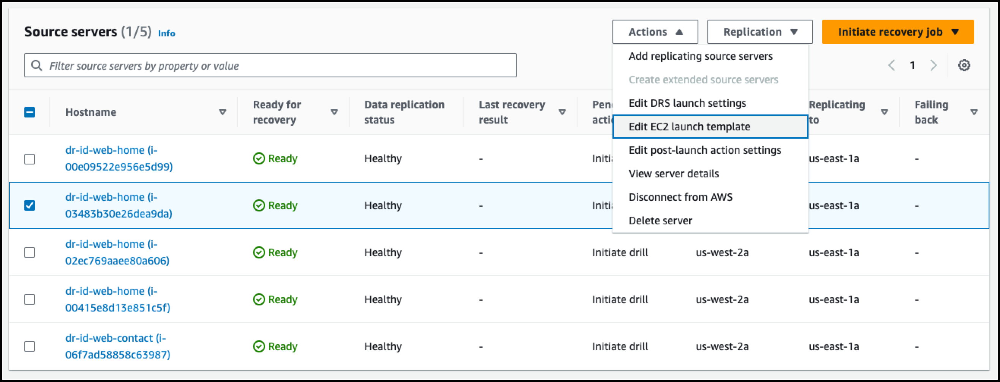
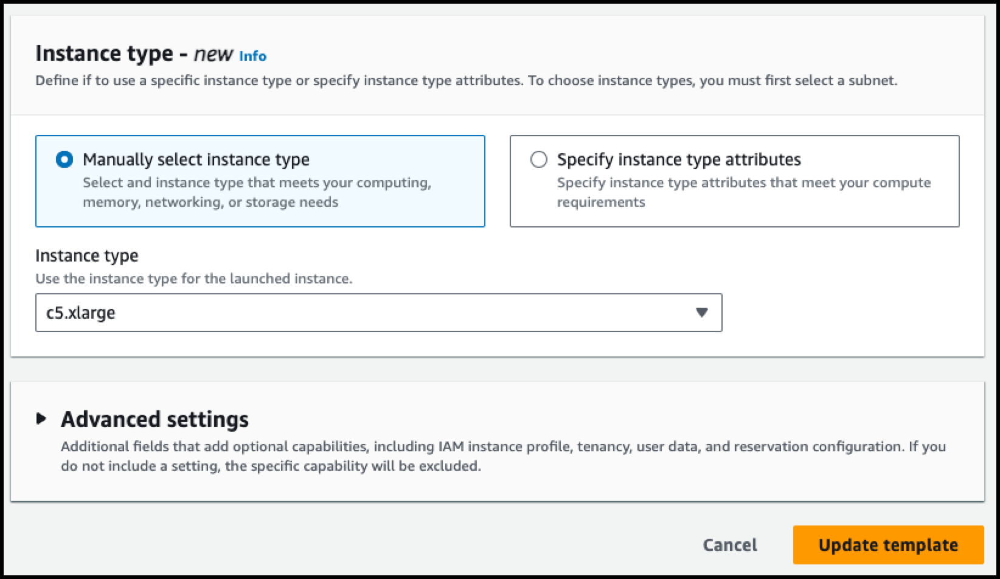
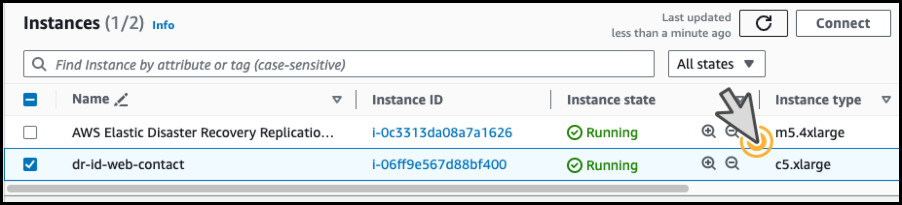
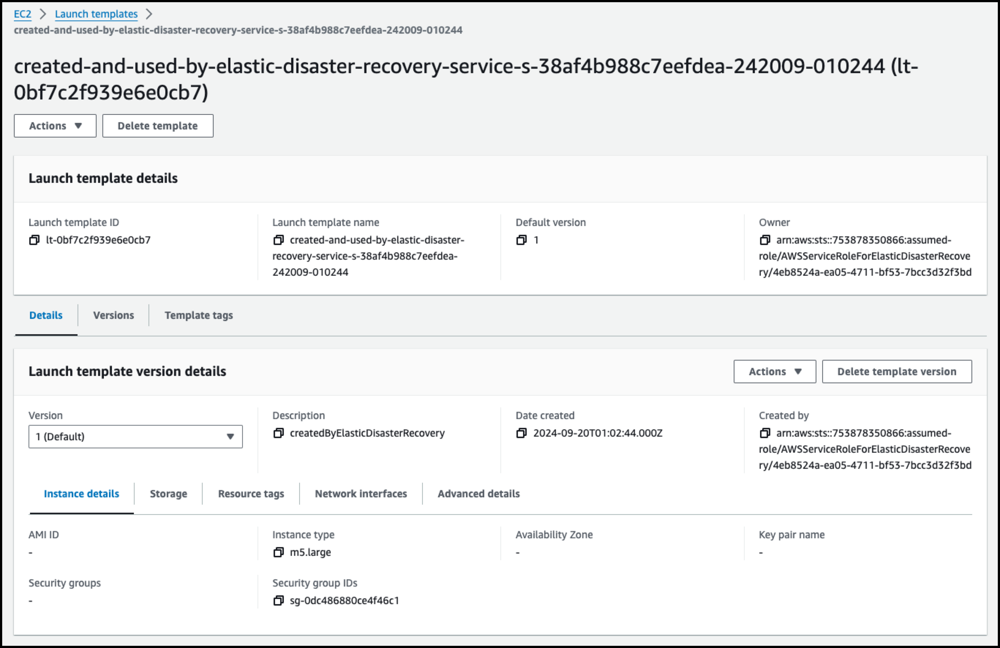
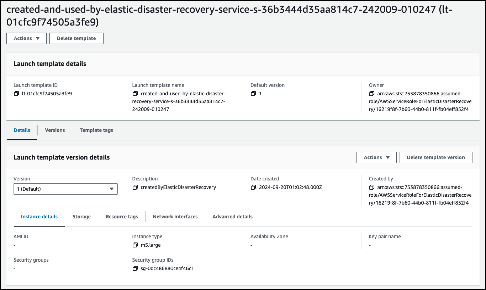
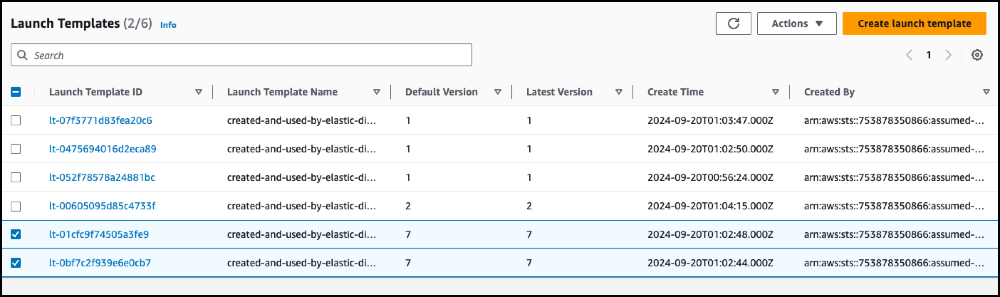
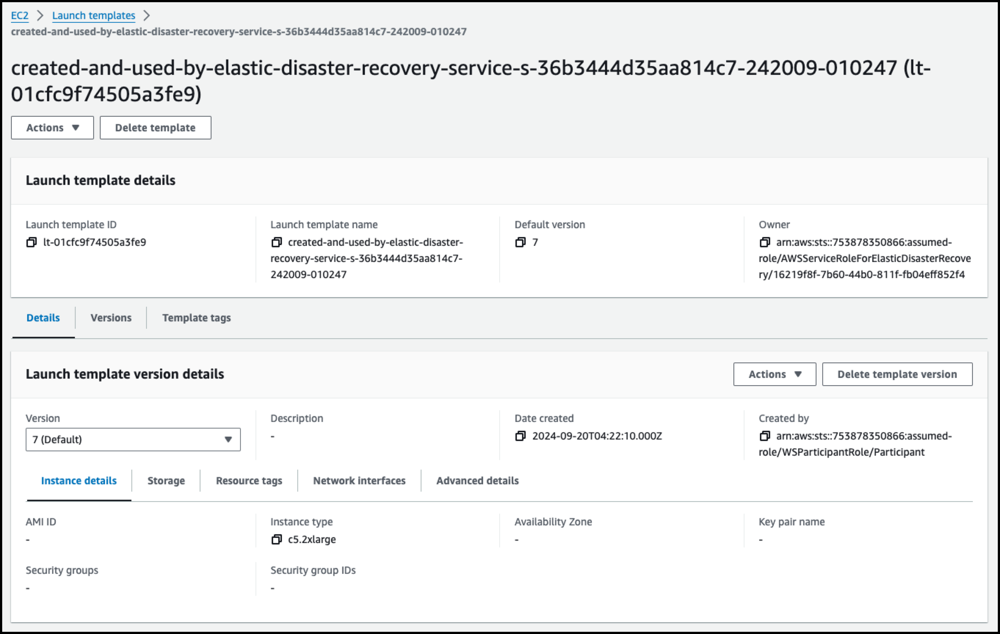
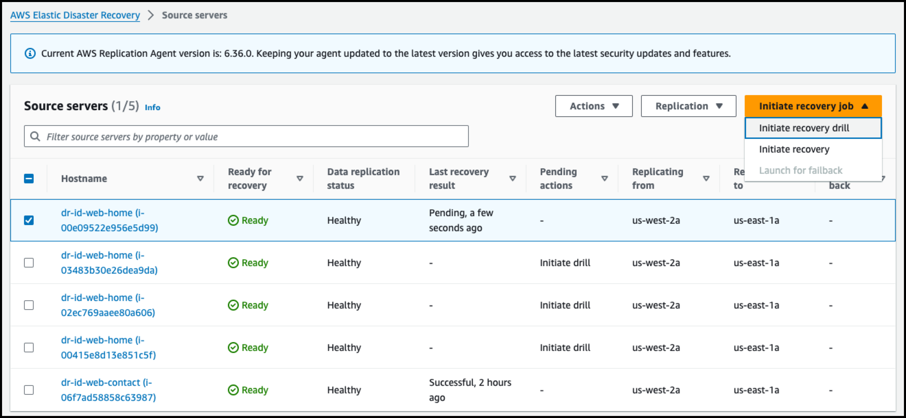
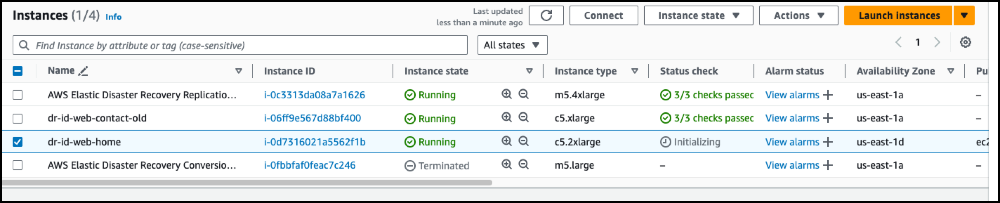

# 4. Launch Template 구분 사용

## 1. Source Server별 DR Launch 수정 방법

###  1. Source Server 선택 후 Actions => Edit EC2 launch template




---

### 2. 원하는 Instance Type이나 구성으로 변경 




---

### 3. Failover Drill Test 후 설정 확인




---

---

---

## 2. 특정 Workload별 Launch Template 일괄 수정 방법

### Dept=FIN Workload 수정한다고 가정

### 1. 기존 Launch Template 확인 (cb7, fe9)






---

### 2. Source Server ID 확인

```
(base) kiwony@kiwonymac.com:/Users/kiwony> aws drs describe-source-servers --region us-east-1 --query 'items[?tags.Dept==`FIN`].{SourceServerID: sourceServerID, ServerName: sourceProperties.hostname, Status: dataReplicationInfo.dataReplicationState, AWSID: sourceProperties.identificationHints.awsInstanceID, ARN: arn, LastLaunchResult: lastLaunchResult, IdentificationHints: sourceProperties.identificationHints, Tags: tags}' --output table|tee
----------------------------------------------------------------------------------------------
|                                    DescribeSourceServers                                   |
+------------------+-------------------------------------------------------------------------+
|  ARN             |  arn:aws:drs:us-east-1:753878350866:source-server/s-38af4b988c7eefdea   |
|  AWSID           |  i-00e09522e956e5d99                                                    |
|  LastLaunchResult|  NOT_STARTED                                                            |
|  ServerName      |  None                                                                   |
|  SourceServerID  |  s-38af4b988c7eefdea                                                    |
|  Status          |  CONTINUOUS                                                             |
+------------------+-------------------------------------------------------------------------+
||                                    IdentificationHints                                   ||
|+-----------------------------------+------------------------------------------------------+|
||  awsInstanceID                    |  i-00e09522e956e5d99                                 ||
||  fqdn                             |  localhost.localdomain                               ||
||  hostname                         |  dr-id-web-home                                      ||
|+-----------------------------------+------------------------------------------------------+|
||                                           Tags                                           ||
|+--------------------------+---------------------------------------------------------------+|
||  Dept                    |  FIN                                                          ||
||  Name                    |  dr-id-web-home                                               ||
|+--------------------------+---------------------------------------------------------------+|
|                                    DescribeSourceServers                                   |
+------------------+-------------------------------------------------------------------------+
|  ARN             |  arn:aws:drs:us-east-1:753878350866:source-server/s-36b3444d35aa814c7   |
|  AWSID           |  i-03483b30e26dea9da                                                    |
|  LastLaunchResult|  NOT_STARTED                                                            |
|  ServerName      |  None                                                                   |
|  SourceServerID  |  s-36b3444d35aa814c7                                                    |
|  Status          |  CONTINUOUS                                                             |
+------------------+-------------------------------------------------------------------------+
||                                    IdentificationHints                                   ||
|+-----------------------------------+------------------------------------------------------+|
||  awsInstanceID                    |  i-03483b30e26dea9da                                 ||
||  fqdn                             |  localhost.localdomain                               ||
||  hostname                         |  dr-id-web-home                                      ||
|+-----------------------------------+------------------------------------------------------+|
||                                           Tags                                           ||
|+--------------------------+---------------------------------------------------------------+|
||  Dept                    |  FIN                                                          ||
||  Name                    |  dr-id-web-home                                               ||
|+--------------------------+---------------------------------------------------------------+|
```

```
(base) kiwony@kiwonymac.com:/Users/kiwony> aws drs describe-source-servers --region us-east-1 --query 'items[?tags.Dept==`FIN`].sourceServerID' --output text|tee
s-38af4b988c7eefdea	s-36b3444d35aa814c7
```


---

### 3. Source Server별 Launch Template 확인

```
(base) kiwony@kiwonymac.com:/Users/kiwony> # Dept=FIN 조건에 해당하는 Server ID 추출
SOURCE_SERVER_IDS=$(aws drs describe-source-servers --region us-east-1 --query 'items[?tags.Dept==`FIN`].sourceServerID' --output text)

# 런치 템플릿 확인
echo "$SOURCE_SERVER_IDS" | tr '\t' '\n' | while read -r SERVER_ID; do
    # garbage character 제거
    SERVER_ID=$(echo $SERVER_ID | xargs)

    # SERVER_ID 패턴 확인
    if [[ $SERVER_ID =~ ^s-[0-9a-zA-Z]{17}$ ]]; then
        LAUNCH_TEMPLATE_ID=$(aws drs get-launch-configuration --region us-east-1 --source-server-id $SERVER_ID --query "ec2LaunchTemplateID" --output text)

        if [ -n "$LAUNCH_TEMPLATE_ID" ]; then
            echo "Source Server ID: $SERVER_ID, Launch Template ID: $LAUNCH_TEMPLATE_ID"
        else
            echo "Source Server ID: $SERVER_ID, Launch Template ID: Not Found"
        fi
    else
        echo "Invalid Source Server ID format: $SERVER_ID"
    fi
done
Source Server ID: s-38af4b988c7eefdea, Launch Template ID: lt-0bf7c2f939e6e0cb7
Source Server ID: s-36b3444d35aa814c7, Launch Template ID: lt-01cfc9f74505a3fe9
```


---

###  4. Source Server별 Launch Template 확인 후 Version2(c5.2xlarge로 변경) 생성, 새로운 Default Version으로 지정

```
(base) kiwony@kiwonymac.com:/Users/kiwony> 
SOURCE_SERVER_IDS=$(aws drs describe-source-servers --region us-east-1 --query 'items[?tags.Dept==`FIN`].sourceServerID' --output text)

# 런치 템플릿 확인
echo "$SOURCE_SERVER_IDS" | tr '\t' '\n' | while read -r SERVER_ID; do
    # garbage character 제거
    SERVER_ID=$(echo $SERVER_ID | xargs)

    # SERVER_ID 패턴 확인
    if [[ $SERVER_ID =~ ^s-[0-9a-zA-Z]{17}$ ]]; then
        LAUNCH_TEMPLATE_ID=$(aws drs get-launch-configuration --region us-east-1 --source-server-id $SERVER_ID --query "ec2LaunchTemplateID" --output text)

        if [ -n "$LAUNCH_TEMPLATE_ID" ]; then
            echo "Source Server ID: $SERVER_ID, Launch Template ID: $LAUNCH_TEMPLATE_ID"

            # 새로운 조건으로 Template 생성
            NEW_VERSION_RESULT=$(aws ec2 create-launch-template-version \
                --region us-east-1 \
                --launch-template-id $LAUNCH_TEMPLATE_ID \
                --launch-template-data '{"InstanceType":"c5.2xlarge"}' \
                --query 'LaunchTemplateVersion.VersionNumber' \
                --output text)

            if [ -n "$NEW_VERSION_RESULT" ]; then
                echo "New Launch Template Version: $NEW_VERSION_RESULT"

                # 새로운 버전 Default 설정
                aws ec2 modify-launch-template \
                    --region us-east-1 \
                    --launch-template-id $LAUNCH_TEMPLATE_ID \
                    --default-version $NEW_VERSION_RESULT

                echo "Updated Launch Template ID: $LAUNCH_TEMPLATE_ID to use c5.2xlarge and set version $NEW_VERSION_RESULT as default."
            else
                echo "Failed to create new launch template version for Source Server ID: $SERVER_ID"
            fi
        else
            echo "Source Server ID: $SERVER_ID, Launch Template ID: Not Found"
        fi
    else
        echo "Invalid Source Server ID format: $SERVER_ID"
    fi
done
Source Server ID: s-38af4b988c7eefdea, Launch Template ID: lt-0bf7c2f939e6e0cb7
New Launch Template Version: 7
Updated Launch Template ID: lt-0bf7c2f939e6e0cb7 to use c5.2xlarge and set version 7 as default.
Source Server ID: s-36b3444d35aa814c7, Launch Template ID: lt-01cfc9f74505a3fe9
New Launch Template Version: 7
Updated Launch Template ID: lt-01cfc9f74505a3fe9 to use c5.2xlarge and set version 7 as default.
```


---

### 5. Template 수정 확인 







---

### 6. Failover Test

**Failover Driill Test **



**새로운 Template 설정 c5.2xlarge 확인**




