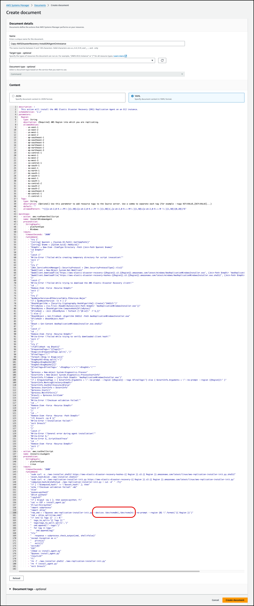
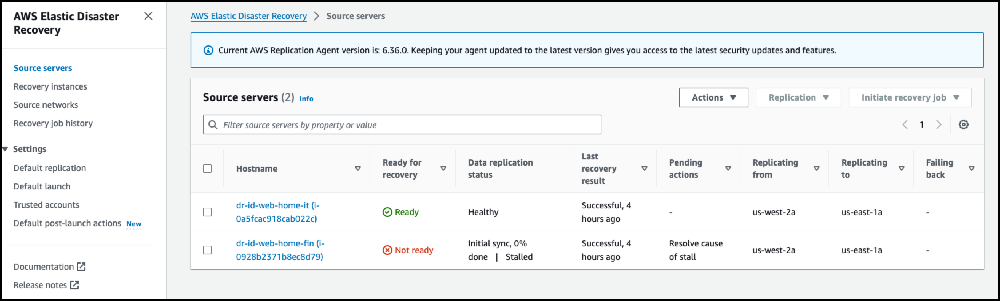

# Source Server에서 특정 Disk만 복제 하는 방법에 대해서 기술합니다.

```
방법 
1. Agent Install 시 Disk를 지정
	a. agent install 시 수동으로 Disk 지정
	b. agent install 시 CLI parameter option 지정
	c. ssm run command에서 template을 수정하여 option 추가 (여러대를 동시에 설치 필요시)

2. 이미 동기화 시작한 경우, agent를 stop, 삭제 후, 재설치하면서 option 지정
	a. Console에서 DRS RI와 Source Server를 Disconnect 하고 재설치하는 방법
	b. CLI를 이용해서 Source Server에서 agent stop 및 uninstall하는 방법
	
	2-a, 2-b는 결과적으로 같은 동작이지만 동작의 주체가 다름

```


### 1-a. agent install 시 수동으로 Disk 지정

```
[root@dr-id-web-home-fin ~]# ./aws-replication-installer-init
The installation of the AWS Replication Agent has started.
AWS Region Name: us-east-1
Identifying volumes for replication.
Choose the disks you want to replicate. Your disks are: /dev/sdc,/dev/sdb,/dev/sdd,/dev/xvda,/dev/nvme0n1,/dev/nvme3n1,/dev/nvme2n1,/dev/nvme1n1
To replicate some of the disks, type the path of the disks, separated with a comma (for example, /dev/sda, /dev/sdb). To replicate all disks, press Enter:/dev/nvme0n1,/dev/nvme3n1
Identified volume for replication: /dev/nvme3n1 of size 10 GiB
Identified volume for replication: /dev/nvme0n1 of size 8 GiB
All volumes for replication were successfully identified.
Downloading the AWS Replication Agent onto the source server...
```


### 1-b. agent install 시 option 지정

```
wget -O ./aws-replication-installer-init https://aws-elastic-disaster-recovery-us-east-1.s3.us-east-1.amazonaws.com/latest/linux/aws-replication-installer-init

chmod +x aws-replication-installer-init;
./aws-replication-installer-init --devices /dev/nvme0n1,/dev/nvme1n1 --no-prompt --region us-east-1
```


### 1-c. ssm run command에서 template을 수정하여 option 추가 (여러대를 동시에 설치 필요시)

```
아래 3. FIN Instance(SSM-Run Command 이용) 부분 참고
```


### 2. 이미 동기화 시작한 경우, agent를 stop, 삭제 후, 재설치하면서 option 지정

### 2-a. Console에서 DRS Target쪽에서 Disconnect 작업 하는 방법

### 2-b. Source Server쪽에서 agent를 stop / uninstall하는 방법

```
[root@dr-id-web-home-fin ~]# cd /var/lib/aws-replication-agent
[root@dr-id-web-home-fin aws-replication-agent]# ./stopAgent.sh
[root@dr-id-web-home-fin aws-replication-agent]# ./uninstall_agent_linux.sh
Running as unit run-22784.service.

wget -O ./aws-replication-installer-init https://aws-elastic-disaster-recovery-us-east-1.s3.us-east-1.amazonaws.com/latest/linux/aws-replication-installer-init

chmod +x aws-replication-installer-init;

./aws-replication-installer-init --devices /dev/nvme0n1,/dev/nvme2n1 
```


---

---


## 1. Agent Install 시 Disk 제외

### 1-a. agent install 시 수동으로 Disk 지정

```
[root@dr-id-web-home-fin ~]# ./aws-replication-installer-init
The installation of the AWS Replication Agent has started.
AWS Region Name: us-east-1
Identifying volumes for replication.
Choose the disks you want to replicate. Your disks are: /dev/sdc,/dev/sdb,/dev/sdd,/dev/xvda,/dev/nvme0n1,/dev/nvme3n1,/dev/nvme2n1,/dev/nvme1n1
To replicate some of the disks, type the path of the disks, separated with a comma (for example, /dev/sda, /dev/sdb). To replicate all disks, press Enter:/dev/nvme0n1,/dev/nvme3n1
Identified volume for replication: /dev/nvme3n1 of size 10 GiB
Identified volume for replication: /dev/nvme0n1 of size 8 GiB
All volumes for replication were successfully identified.
Downloading the AWS Replication Agent onto the source server...
```


---


---

### 1-b. HR Instance(agent install 시 CLI parameter option 지정)


```
wget -O ./aws-replication-installer-init https://aws-elastic-disaster-recovery-us-east-1.s3.us-east-1.amazonaws.com/latest/linux/aws-replication-installer-init

chmod +x aws-replication-installer-init;

./aws-replication-installer-init --devices /dev/nvme0n1,/dev/nvme2n1 --no-prompt --region us-east-1
```


**cli paraemter로 DISK 지정**

```
[root@dr-id-web-home-hr ~]# ./aws-replication-installer-init --devices /dev/nvme0n1,/dev/nvme2n1 --no-prompt --region us-east-1
The installation of the AWS Replication Agent has started.
Identifying volumes for replication.
Identified volume for replication: /dev/nvme2n1 of size 10 GiB
Identified volume for replication: /dev/nvme0n1 of size 8 GiB
All volumes for replication were successfully identified.
Downloading the AWS Replication Agent onto the source server...
```


**Target쪽 Drill Test후 2개 Disk 동기화 확인 (virginia)**

```
root@dr-id-web-home-hr@VIRGINIA:/root# df -h
Filesystem      Size  Used Avail Use% Mounted on
devtmpfs        3.8G     0  3.8G   0% /dev
tmpfs           3.8G     0  3.8G   0% /dev/shm
tmpfs           3.8G  404K  3.8G   1% /run
tmpfs           3.8G     0  3.8G   0% /sys/fs/cgroup
/dev/nvme0n1p1  8.0G  2.2G  5.8G  28% /
/dev/nvme1n1     10G  664M  9.4G   7% /data2
tmpfs           776M     0  776M   0% /run/user/0
root@dr-id-web-home-hr@VIRGINIA:/root# ls /dev/nvme*
/dev/nvme0  /dev/nvme0n1  /dev/nvme0n1p1  /dev/nvme0n1p128  /dev/nvme1  /dev/nvme1n1
root@dr-id-web-home-hr@VIRGINIA:/root# ls -alrt /dev/nvme*
crw------- 1 root root 250, 0 Sep 22 10:22 /dev/nvme0
crw------- 1 root root 250, 1 Sep 22 10:22 /dev/nvme1
brw-rw---- 1 root disk 259, 0 Sep 22 10:22 /dev/nvme1n1
brw-rw---- 1 root disk 259, 1 Sep 22 10:22 /dev/nvme0n1
brw-rw---- 1 root disk 259, 2 Sep 22 10:22 /dev/nvme0n1p1
brw-rw---- 1 root disk 259, 3 Sep 22 10:22 /dev/nvme0n1p128
```


---

### 1-c. FIN Instance(SSM-Run Command 이용)

**1. AWSDisasterRecovery-InstallDRAgentOnInstance를 복제**


**2. --devices 부분을 추가 후 저장**




**3. 생성한  Template으로 Agent Install**


**4. Target쪽 Drill Test 후 확인(2개 Disk만 복제 확인)**

```
root@dr-id-web-home-fin@VIRGINIA:/root# df -h
Filesystem      Size  Used Avail Use% Mounted on
devtmpfs        3.8G     0  3.8G   0% /dev
tmpfs           3.8G     0  3.8G   0% /dev/shm
tmpfs           3.8G  408K  3.8G   1% /run
tmpfs           3.8G     0  3.8G   0% /sys/fs/cgroup
/dev/nvme0n1p1  8.0G  2.2G  5.9G  28% /
/dev/nvme1n1     10G  558M  9.5G   6% /data2
tmpfs           776M     0  776M   0% /run/user/0
root@dr-id-web-home-fin@VIRGINIA:/root# ls -alrt /dev/nvme*
crw------- 1 root root 250, 0 Sep 22 10:22 /dev/nvme0
crw------- 1 root root 250, 1 Sep 22 10:22 /dev/nvme1
brw-rw---- 1 root disk 259, 0 Sep 22 10:22 /dev/nvme1n1
brw-rw---- 1 root disk 259, 1 Sep 22 10:22 /dev/nvme0n1
brw-rw---- 1 root disk 259, 2 Sep 22 10:22 /dev/nvme0n1p1
brw-rw---- 1 root disk 259, 3 Sep 22 10:22 /dev/nvme0n1p128
```


---

### 1-z. IT Instance (agent 수동 설치 시 --no-prompt option을 안주면 전체 disk 대상으로 동작)

```
[root@dr-id-web-home-it ~]# ls -alrt /dev/nvme*
crw------- 1 root root 250, 3 Sep 22 08:35 /dev/nvme3
crw------- 1 root root 250, 1 Sep 22 08:35 /dev/nvme1
crw------- 1 root root 250, 0 Sep 22 08:35 /dev/nvme0
crw------- 1 root root 250, 2 Sep 22 08:35 /dev/nvme2
brw-rw---- 1 root disk 259, 3 Sep 22 08:35 /dev/nvme0n1
brw-rw---- 1 root disk 259, 5 Sep 22 08:35 /dev/nvme0n1p128
brw-rw---- 1 root disk 259, 4 Sep 22 08:35 /dev/nvme0n1p1
brw-rw---- 1 root disk 259, 0 Sep 22 08:53 /dev/nvme1n1
brw-rw---- 1 root disk 259, 2 Sep 22 08:53 /dev/nvme2n1
brw-rw---- 1 root disk 259, 1 Sep 22 08:53 /dev/nvme3n1

[root@dr-id-web-home-it ~]# fdisk -l|grep dev
Disk /dev/nvme1n1: 10 GiB, 10737418240 bytes, 20971520 sectors
Disk /dev/nvme3n1: 10 GiB, 10737418240 bytes, 20971520 sectors
Disk /dev/nvme2n1: 10 GiB, 10737418240 bytes, 20971520 sectors
Disk /dev/nvme0n1: 8 GiB, 8589934592 bytes, 16777216 sectors
/dev/nvme0n1p1    4096 16777182 16773087   8G Linux filesystem
/dev/nvme0n1p128  2048     4095     2048   1M BIOS boot

[root@dr-id-web-home-it ~]# fdisk -l
Disk /dev/nvme1n1: 10 GiB, 10737418240 bytes, 20971520 sectors
Units: sectors of 1 * 512 = 512 bytes
Sector size (logical/physical): 512 bytes / 512 bytes
I/O size (minimum/optimal): 512 bytes / 512 bytes


Disk /dev/nvme3n1: 10 GiB, 10737418240 bytes, 20971520 sectors
Units: sectors of 1 * 512 = 512 bytes
Sector size (logical/physical): 512 bytes / 512 bytes
I/O size (minimum/optimal): 512 bytes / 512 bytes


Disk /dev/nvme2n1: 10 GiB, 10737418240 bytes, 20971520 sectors
Units: sectors of 1 * 512 = 512 bytes
Sector size (logical/physical): 512 bytes / 512 bytes
I/O size (minimum/optimal): 512 bytes / 512 bytes


Disk /dev/nvme0n1: 8 GiB, 8589934592 bytes, 16777216 sectors
Units: sectors of 1 * 512 = 512 bytes
Sector size (logical/physical): 512 bytes / 512 bytes
I/O size (minimum/optimal): 512 bytes / 512 bytes
Disklabel type: gpt
Disk identifier: A755DCAB-EA92-43CC-948E-6409BE1B13D9

Device           Start      End  Sectors Size Type
/dev/nvme0n1p1    4096 16777182 16773087   8G Linux filesystem
/dev/nvme0n1p128  2048     4095     2048   1M BIOS boot

Partition table entries are not in disk order.
```


```
wget -O ./aws-replication-installer-init https://aws-elastic-disaster-recovery-us-east-1.s3.us-east-1.amazonaws.com/latest/linux/aws-replication-installer-init

chmod +x aws-replication-installer-init;

./aws-replication-installer-init --devices /dev/nvme0n1,/dev/nvme2n1 
```


**devices Option을 줘도 동작안함... --no-prompts option필요** 

```
[root@dr-id-web-home-it ~]# ./aws-replication-installer-init --devices /dev/nvme0n1,/dev/nvme2n1
The installation of the AWS Replication Agent has started.
AWS Region Name: us-east-1
Identifying volumes for replication.
Choose the disks you want to replicate. Your disks are: /dev/sdc,/dev/xvda,/dev/sdd,/dev/sdb,/dev/nvme0n1,/dev/nvme2n1,/dev/nvme3n1,/dev/nvme1n1
To replicate some of the disks, type the path of the disks, separated with a comma (for example, /dev/sda, /dev/sdb). To replicate all disks, press Enter:
Identified volume for replication: /dev/nvme3n1 of size 10 GiB
Identified volume for replication: /dev/nvme1n1 of size 10 GiB
Identified volume for replication: /dev/nvme2n1 of size 10 GiB
Identified volume for replication: /dev/nvme0n1 of size 8 GiB
All volumes for replication were successfully identified.
Downloading the AWS Replication Agent onto the source server...
```


```
export REGION=VIRGINIA
export PS1='\u@\h@$REGION:$PWD# '
```


**Drill Test 후 Target Region 확인하면 4개 모두 복제 되는 것을 확인 가능** 

```
root@dr-id-web-home-it@VIRGINIA:/root# df -h
Filesystem      Size  Used Avail Use% Mounted on
devtmpfs        3.8G     0  3.8G   0% /dev
tmpfs           3.8G     0  3.8G   0% /dev/shm
tmpfs           3.8G  424K  3.8G   1% /run
tmpfs           3.8G     0  3.8G   0% /sys/fs/cgroup
/dev/nvme0n1p1  8.0G  2.3G  5.8G  29% /
/dev/nvme1n1     10G  556M  9.5G   6% /data1
/dev/nvme2n1     10G  549M  9.5G   6% /data3
/dev/nvme3n1     10G  616M  9.4G   7% /data2
tmpfs           776M     0  776M   0% /run/user/0
```


---

---

---

## 2-a. 이미 동기화 중인 FIN Instance의 Volume 갯수 조정(2개에서 1개만 복제)

1. **Recovery Instance Diconnect**


2. **Recovery Instance 삭제**


3. **RI 삭제 확인**


4. **Source Server Diconnect(이 시점에 자동으로 Source Server Agent Stop/uninstall)**


5. **Diconnect 확인**


```
Source Server Disconnect 후 /var/lib/aws-replication-agent Directory의 모든 파일이 제거 되었음

따라서 아래 스텝의 2 스크립트 실행도 불가하지만, 이미 Agent Daemon과 Process는 종료 확인됨
./stopAgent.sh
./uninstall_agent_linux.sh
https://docs.aws.amazon.com/drs/latest/userguide/uninstalling-agent.html

```


6. **agent re-install하면서 원하는 Disk만 지정**

```
wget -O ./aws-replication-installer-init https://aws-elastic-disaster-recovery-us-east-1.s3.us-east-1.amazonaws.com/latest/linux/aws-replication-installer-init

chmod +x aws-replication-installer-init;

./aws-replication-installer-init --devices /dev/nvme0n1 --no-prompt --region us-east-1
```


```
[root@dr-id-web-home-fin ~]# ./aws-replication-installer-init --devices /dev/nvme0n1 --no-prompt --region us-east-1
The installation of the AWS Replication Agent has started.
Identifying volumes for replication.
Identified volume for replication: /dev/nvme0n1 of size 8 GiB
All volumes for replication were successfully identified.
Downloading the AWS Replication Agent onto the source server...
Finished.
Installing the AWS Replication Agent onto the source server...
Finished.
Syncing the source server with the Elastic Disaster Recovery Console...
Finished.
Source Network already exists for vpc: vpc-01918874f8e7b0583.
The following is the source server ID: s-3fd28c8524cfe1dcf.
The AWS Replication Agent was successfully installed.
```


7. **Disconnect 되었던 Source Server가 Not Ready 로 변경**




8. **Initial Sync 시작**


9. **Disk를 확인해보면 기존의 2개의 Disk에서 1개로 줄어든 것을 확인**


---

---

---

### 2-b. IT에서 확인

1. **기존에는 4개의 Disk 동기화중**


2. **agent daemon 확인**

```
[root@dr-id-web-home-it ~]# ps -efa|grep -i agent
root      2320     1  0 08:35 ?        00:00:00 /usr/bin/amazon-ssm-agent
root      2427  2320  0 08:35 ?        00:00:02 /usr/bin/ssm-agent-worker
aws-rep+ 16382     1  0 09:01 ?        00:00:02 /var/lib/aws-replication-agent/tailer -a agent.config -f agent.log.0
aws-rep+ 16383     1  0 09:01 ?        00:00:00 /var/lib/aws-replication-agent/run_linux_migration_scripts_periodically -a agent.config -s
aws-rep+ 16384     1  0 09:01 ?        00:00:07 /var/lib/aws-replication-agent/update_onprem_volumes -a agent.config
aws-rep+ 16385     1  0 09:01 ?        00:02:10 /var/lib/aws-replication-agent/jre/bin/java -client -Xms88m -Xmx88m -XX:+HeapDumpOnOutOfMemoryError -XX:HeapDumpPath=./client.hprof -classpath External/*:*:. -XX:ErrorFile=./java_error.log -XX:-CreateMinidumpOnCrash -Djava.io.tmpdir=/var/lib/aws-replication-agent/.tmp -Djna.nosys=true com.amazonaws.cloudendure.drs.agent.Main agent.config
aws-rep+ 16417 16382  0 09:01 ?        00:00:00 tail -n10 -F agent.log.0
root     20655 20635  0 13:57 pts/0    00:00:00 grep --color=auto -i agent
```


3. **aws-replication-agent directory 확인**

```
[root@dr-id-web-home-it ~]# cd /var/lib/aws-replication-agent
[root@dr-id-web-home-it aws-replication-agent]# ls -alrt
total 40120
drwxr-x---  4 root            aws-replication       95 Jul 11 17:21 jre
drwxr-x---  2 root            aws-replication       83 Sep  9 10:31 migration_scripts
drwxr-x---  2 root            aws-replication     4096 Sep  9 10:31 External
drwxr-x---  3 root            aws-replication      242 Sep  9 10:31 dist
drwxr-xr-x 34 root            root                4096 Sep 22 09:01 ..
-rwxr-x---  1 root            aws-replication      886 Sep 22 09:01 uninstall-agent.sh
-rwxr-x---  1 root            aws-replication     1031 Sep 22 09:01 removeDriver.sh
-rwxr-x---  1 root            aws-replication     1584 Sep 22 09:01 prepare-agent-config.sh
-rwxr-x---  1 root            aws-replication     1109 Sep 22 09:01 killAuxProcesses.sh
-rwxr-x---  1 root            aws-replication      980 Sep 22 09:01 commands.sh
-rw-r-----  1 root            aws-replication      146 Sep 22 09:01 aws-replication-prepare.template
-rw-r-----  1 root            aws-replication    39994 Sep 22 09:01 aws-replication-credentials-provider.jar
-rw-r-----  1 root            aws-replication   346206 Sep 22 09:01 aws-replication-common.jar
-rw-r-----  1 root            aws-replication   588230 Sep 22 09:01 aws-replication-agent.jar
-rwxr-x---  1 root            aws-replication 25589392 Sep 22 09:01 install_agent
-rw-r-----  1 root            aws-replication       20 Sep 22 09:01 VERSION
-rw-r-----  1 root            aws-replication   254033 Sep 22 09:01 THIRD_PARTY_ATTRIBUTIONS.txt
-rw-r-----  1 root            aws-replication      844 Sep 22 09:01 notice.txt
-rw-r-----  1 root            aws-replication     1239 Sep 22 09:01 license.txt
-rwxr-x---  1 root            aws-replication   604704 Sep 22 09:01 ld-musl-1.2.4-x86_64.so.1
lrwxrwxrwx  1 root            root                  59 Sep 22 09:01 check_server_id_changed -> /var/lib/aws-replication-agent/dist/check_server_id_changed
-rwxr-x---  1 root            aws-replication    18376 Sep 22 09:01 aws-replication-driver-commander
-rwxr-x---  1 root            aws-replication    23048 Sep 22 09:01 aws-replication-boot-tracker
lrwxrwxrwx  1 root            root                  57 Sep 22 09:01 update_onprem_volumes -> /var/lib/aws-replication-agent/dist/update_onprem_volumes
lrwxrwxrwx  1 root            root                  42 Sep 22 09:01 tailer -> /var/lib/aws-replication-agent/dist/tailer
lrwxrwxrwx  1 root            root                  76 Sep 22 09:01 run_linux_migration_scripts_periodically -> /var/lib/aws-replication-agent/dist/run_linux_migration_scripts_periodically
lrwxrwxrwx  1 root            root                  54 Sep 22 09:01 nvme_device_mapper -> /var/lib/aws-replication-agent/dist/nvme_device_mapper
-rwxr-x---  1 root            aws-replication       82 Sep 22 09:01 uninstall_agent_linux.sh
-rwxr-x---  1 root            aws-replication      279 Sep 22 09:01 stopAgent.sh
-rwxr-x---  1 root            aws-replication      539 Sep 22 09:01 shutdown-agent.sh
-rwxr-x---  1 root            aws-replication       52 Sep 22 09:01 runAgent.sh
-rwxr-x---  1 root            aws-replication     1390 Sep 22 09:01 move-driver-to-shutdown.sh
-rwxr-x---  1 root            aws-replication     1756 Sep 22 09:01 insertDriver.sh
-rwxr-x---  1 root            aws-replication      535 Sep 22 09:01 functions.sh
-rwxr-x---  1 root            aws-replication      325 Sep 22 09:01 aws-replication-schedule-driver-update.sh
-rw-r-----  1 root            aws-replication  1910824 Sep 22 09:01 aws-replication-driver.ko
-rw-------  1 root            root            11343926 Sep 22 09:01 initramfs-4.14.352-267.564.amzn2.x86_64.img
-rw-r-----  1 aws-replication aws-replication      993 Sep 22 09:01 agent.config
prw-r-----  1 aws-replication aws-replication        0 Sep 22 09:01 shutdown_pipe
-rw-r-----  1 aws-replication aws-replication      213 Sep 22 09:01 aws-replication-prepare.env
-rw-------  1 aws-replication aws-replication        0 Sep 22 09:01 agent.log.0.lck
-rw-------  1 aws-replication aws-replication    34510 Sep 22 09:06 ce.dmesg.log.sent
-rw-------  1 aws-replication aws-replication      525 Sep 22 13:03 ce_uuid_data
-rw-r--r--  1 aws-replication aws-replication    28706 Sep 22 13:51 post_install_migration.log.sent
drwxr-x---  3 aws-replication aws-replication       68 Sep 22 13:55 .tmp
-rw-r--r--  1 aws-replication aws-replication       41 Sep 22 13:56 agent.log.0.last
-rw-------  1 aws-replication aws-replication   172852 Sep 22 13:56 agent.log.0
drwxrwx--T  7 root            aws-replication     4096 Sep 22 13:56 .
```


4. **RI Disconnect & Delete**


5. **Source Server agent 상태 확인**

```
[root@dr-id-web-home-it aws-replication-agent]# ps -efa|grep -i agentroot      2320     1  0 08:35 ?        00:00:00 /usr/bin/amazon-ssm-agent
root      2427  2320  0 08:35 ?        00:00:02 /usr/bin/ssm-agent-worker
aws-rep+ 16382     1  0 09:01 ?        00:00:02 /var/lib/aws-replication-agent/tailer -a agent.config -f agent.log.0
aws-rep+ 16383     1  0 09:01 ?        00:00:00 /var/lib/aws-replication-agent/run_linux_migration_scripts_periodically -a agent.config -s
aws-rep+ 16384     1  0 09:01 ?        00:00:07 /var/lib/aws-replication-agent/update_onprem_volumes -a agent.config
aws-rep+ 16385     1  0 09:01 ?        00:02:10 /var/lib/aws-replication-agent/jre/bin/java -client -Xms88m -Xmx88m -XX:+HeapDumpOnOutOfMemoryError -XX:HeapDumpPath=./client.hprof -classpath External/*:*:. -XX:ErrorFile=./java_error.log -XX:-CreateMinidumpOnCrash -Djava.io.tmpdir=/var/lib/aws-replication-agent/.tmp -Djna.nosys=true com.amazonaws.cloudendure.drs.agent.Main agent.config
aws-rep+ 16417 16382  0 09:01 ?        00:00:00 tail -n10 -F agent.log.0
root     20933 20635  0 14:09 pts/0    00:00:00 grep --color=auto -i agent[root@dr-id-web-home-it aws-replication-agent]# lsagent.config                              aws-replication-schedule-driver-update.sh    killAuxProcesses.sh                       shutdown-agent.sh
agent.log.0                               ce.dmesg.log.sent                            ld-musl-1.2.4-x86_64.so.1                 shutdown_pipe
agent.log.0.last                          ce_uuid_data                                 license.txt                               stopAgent.sh
agent.log.0.lck                           check_server_id_changed                      migration_scripts                         tailer
aws-replication-agent.jar                 commands.sh                                  move-driver-to-shutdown.sh                THIRD_PARTY_ATTRIBUTIONS.txt
aws-replication-boot-tracker              dist                                         notice.txt                                uninstall_agent_linux.sh
aws-replication-common.jar                External                                     nvme_device_mapper                        uninstall-agent.sh
aws-replication-credentials-provider.jar  functions.sh                                 post_install_migration.log.sent           update_onprem_volumes
aws-replication-driver-commander          initramfs-4.14.352-267.564.amzn2.x86_64.img  prepare-agent-config.sh                   VERSION
aws-replication-driver.ko                 insertDriver.sh                              removeDriver.shaws-replication-prepare.env               install_agent                                runAgent.shaws-replication-prepare.template          jre                                          run_linux_migration_scripts_periodically
```


6. **Stop Agent from Source Server**

```
root@dr-id-web-home-it aws-replication-agent]# ./stopAgent.sh
[root@dr-id-web-home-it aws-replication-agent]# ps -efa|grep -i agent
root      2320     1  0 08:35 ?        00:00:00 /usr/bin/amazon-ssm-agent
root      2427  2320  0 08:35 ?        00:00:02 /usr/bin/ssm-agent-worker
root     21052 20635  0 14:11 pts/0    00:00:00 grep --color=auto -i agent
[root@dr-id-web-home-it aws-replication-agent]# ls
agent.config                               ce_agent_state                               killAuxProcesses.sh                       shutdown-agent.sh
agent.log.0                                ce.dmesg.log.sent                            ld-musl-1.2.4-x86_64.so.1                 shutdown_pipe
agent.log.0.last                           ce_uuid_data                                 license.txt                               stopAgent.shaws-replication-agent.jar                  check_server_id_changed                      migration_scripts                         taileraws-replication-boot-tracker               commands.sh                                  move-driver-to-shutdown.sh                THIRD_PARTY_ATTRIBUTIONS.txt
aws-replication-common.jar                 dist                                         notice.txt                                uninstall_agent_linux.sh
aws-replication-credentials-provider.jar   External                                     nvme_device_mapper                        uninstall-agent.sh
aws-replication-driver-commander           functions.sh                                 post_install_migration.log.sent           update_onprem_volumes
aws-replication-driver.ko                  initramfs-4.14.352-267.564.amzn2.x86_64.img  prepare-agent-config.sh                   VERSION
aws-replication-prepare.env                insertDriver.sh                              removeDriver.sh
aws-replication-prepare.template           install_agent                                runAgent.sh
aws-replication-schedule-driver-update.sh  jre                                          run_linux_migration_scripts_periodically
```


7. **DRS Source Server에서 Lag 발생 알림**


8. **uninstall agent(파일 모두 삭제 됨), DRS Source Server에서는 계속 Lag 증가**

```
[root@dr-id-web-home-it aws-replication-agent]# sh -x ./uninstall_agent_linux.sh
+ systemd-run /var/lib/aws-replication-agent/uninstall-agent.sh
Running as unit run-21092.service.
root@dr-id-web-home-it aws-replication-agent]# ls
root@dr-id-web-home-it aws-replication-agent]#

```


9. **agent Re-install 및 Disk 2개만 복제**

```
wget -O ./aws-replication-installer-init https://aws-elastic-disaster-recovery-us-east-1.s3.us-east-1.amazonaws.com/latest/linux/aws-replication-installer-init

chmod +x aws-replication-installer-init;

./aws-replication-installer-init --devices /dev/nvme0n1,/dev/nvme1n1 --no-prompt --region us-east-1
```


```
[root@dr-id-web-home-it ~]# wget -O ./aws-replication-installer-init https://aws-elastic-disaster-recovery-us-east-1.s3.us-east-1.amazonaws.com/latest/linux/aws-replication-installer-init--2024-09-22 14:18:09--  https://aws-elastic-disaster-recovery-us-east-1.s3.us-east-1.amazonaws.com/latest/linux/aws-replication-installer-initResolving aws-elastic-disaster-recovery-us-east-1.s3.us-east-1.amazonaws.com (aws-elastic-disaster-recovery-us-east-1.s3.us-east-1.amazonaws.com)... 52.217.140.26, 54.231.161.10, 52.217.200.154, ...
Connecting to aws-elastic-disaster-recovery-us-east-1.s3.us-east-1.amazonaws.com (aws-elastic-disaster-recovery-us-east-1.s3.us-east-1.amazonaws.com)|52.217.140.26|:443... connected.HTTP request sent, awaiting response... 200 OKLength: 11804872 (11M) [binary/octet-stream]
Saving to: ‘./aws-replication-installer-init’

100%[===============================================================================================================================================>] 11,804,872  17.9MB/s   in 0.6s

2024-09-22 14:18:10 (17.9 MB/s) - ‘./aws-replication-installer-init’ saved [11804872/11804872]

[root@dr-id-web-home-it ~]# chmod +x aws-replication-installer-init;
[root@dr-id-web-home-it ~]# ./aws-replication-installer-init --devices /dev/nvme0n1,/dev/nvme1n1 --no-prompt --region us-east-1
The installation of the AWS Replication Agent has started.Identifying volumes for replication.Identified volume for replication: /dev/nvme0n1 of size 8 GiB
Identified volume for replication: /dev/nvme1n1 of size 10 GiB
All volumes for replication were successfully identified.
Downloading the AWS Replication Agent onto the source server...
Finished.
Installing the AWS Replication Agent onto the source server...
Finished.
Syncing the source server with the Elastic Disaster Recovery Console...
Finished.
Source Network already exists for vpc: vpc-01918874f8e7b0583.The following is the source server ID: s-32cb0c1cd90c99049.The AWS Replication Agent was successfully installed.
```


**Re-scan이 발생함을 확인**


**기존 4개의 Disk에서 2개로 줄어든 것을 확인**


**모든 Lag을 따라 잡고 정상 Ready상태 확인**


**Drill Test 후 결과 확인**


**Drill Target EC2가 올라오면서 RI도 올라온 것을 확인**


**기존 4개의 Volume에서 2개로 바뀐 것을 확인**


```
root@dr-id-web-home-it@VIRGINIA:/root# df -h
Filesystem      Size  Used Avail Use% Mounted on
devtmpfs        3.8G     0  3.8G   0% /dev
tmpfs           3.8G     0  3.8G   0% /dev/shm
tmpfs           3.8G  408K  3.8G   1% /run
tmpfs           3.8G     0  3.8G   0% /sys/fs/cgroup
/dev/nvme0n1p1  8.0G  2.3G  5.8G  28% /
/dev/nvme1n1     10G  556M  9.5G   6% /data1
tmpfs           776M     0  776M   0% /run/user/0
```


