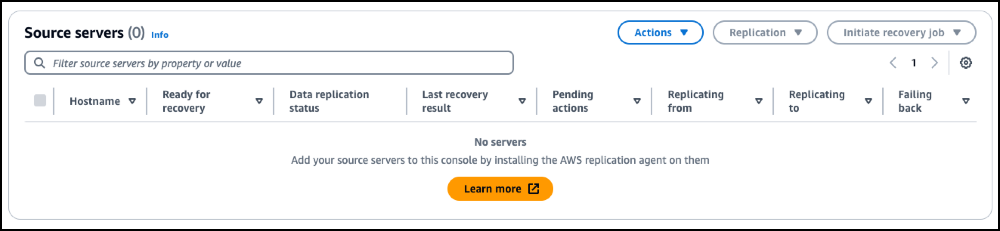

# 6. 복제 설정 Source Server 삭제 절차


### 1. Source Server ID 확인

```
(base) kiwony@kiwonymac.com:/Users/kiwony> aws drs describe-source-servers --region ap-northeast-1 --query 'items[*].{SourceServerID: sourceServerID, ServerName: sourceProperties.hostname, Status: dataReplicationInfo.dataReplicationState, AWSID: sourceProperties.identificationHints.awsInstanceID, ARN: arn, LastLaunchResult: lastLaunchResult, IdentificationHints: sourceProperties.identificationHints}' --output table
```


```
(base) kiwony@kiwonymac.com:/Users/kiwony> aws drs describe-source-servers --region ap-northeast-1 --query 'items[*].{SourceServerID: sourceServerID, ServerName: sourceProperties.hostname, Status: dataReplicationInfo.dataReplicationState, AWSID: sourceProperties.identificationHints.awsInstanceID, ARN: arn, LastLaunchResult: lastLaunchResult, IdentificationHints: sourceProperties.identificationHints}' |jq


[
  {
    "SourceServerID": "s-6dec5cdc5ccf9d537",
    "ServerName": null,
    "Status": "CONTINUOUS",
    "AWSID": "i-0ecdb3884989d306a",
    "ARN": "arn:aws:drs:ap-northeast-1:664695030410:source-server/s-6dec5cdc5ccf9d537",
    "LastLaunchResult": "NOT_STARTED",
    "IdentificationHints": {
      "awsInstanceID": "i-0ecdb3884989d306a",
      "fqdn": "ip-10-0-29-0.ap-northeast-2.compute.internal",
      "hostname": "ip-10-0-29-0.ap-northeast-2.compute.internal"
    }
  },
  {
    "SourceServerID": "s-6401eaf127460c60c",
    "ServerName": null,
    "Status": "CONTINUOUS",
    "AWSID": "i-03f991dd9a19d7745",
    "ARN": "arn:aws:drs:ap-northeast-1:664695030410:source-server/s-6401eaf127460c60c",
    "LastLaunchResult": "SUCCEEDED",
    "IdentificationHints": {
      "awsInstanceID": "i-03f991dd9a19d7745",
      "fqdn": "ip-10-0-23-114.ap-northeast-2.compute.internal",
      "hostname": "ip-10-0-23-114.ap-northeast-2.compute.internal"
    }
  },
  {
    "SourceServerID": "s-68f4711337ddb941c",
    "ServerName": null,
    "Status": "CONTINUOUS",
    "AWSID": "i-06d34b3a63a24cd6f",
    "ARN": "arn:aws:drs:ap-northeast-1:664695030410:source-server/s-68f4711337ddb941c",
    "LastLaunchResult": "NOT_STARTED",
    "IdentificationHints": {
      "awsInstanceID": "i-06d34b3a63a24cd6f",
      "fqdn": "ip-10-0-19-197.ap-northeast-2.compute.internal",
      "hostname": "ip-10-0-19-197.ap-northeast-2.compute.internal"
    }
  }
]
```


---

### 2. 삭제를 위한 Disconnect Server 작업 수행

```
(base) kiwony@kiwonymac.com:/Users/kiwony> aws drs disconnect-source-server --source-server-id s-68f4711337ddb941c --region ap-northeast-1

```


```
(base) kiwony@kiwonymac.com:/Users/kiwony> aws drs describe-source-servers --region ap-northeast-1 --query 'items[*].{SourceServerID: sourceServerID, ServerName: sourceProperties.hostname, Status: dataReplicationInfo.dataReplicationState, AWSID: sourceProperties.identificationHints.awsInstanceID, ARN: arn, LastLaunchResult: lastLaunchResult, IdentificationHints: sourceProperties.identificationHints}' |jq
[
  {
    "SourceServerID": "s-6dec5cdc5ccf9d537",
    "ServerName": null,
    "Status": "CONTINUOUS",
    "AWSID": "i-0ecdb3884989d306a",
    "ARN": "arn:aws:drs:ap-northeast-1:664695030410:source-server/s-6dec5cdc5ccf9d537",
    "LastLaunchResult": "NOT_STARTED",
    "IdentificationHints": {
      "awsInstanceID": "i-0ecdb3884989d306a",
      "fqdn": "ip-10-0-29-0.ap-northeast-2.compute.internal",
      "hostname": "ip-10-0-29-0.ap-northeast-2.compute.internal"
    }
  },
  {
    "SourceServerID": "s-6401eaf127460c60c",
    "ServerName": null,
    "Status": "CONTINUOUS",
    "AWSID": "i-03f991dd9a19d7745",
    "ARN": "arn:aws:drs:ap-northeast-1:664695030410:source-server/s-6401eaf127460c60c",
    "LastLaunchResult": "SUCCEEDED",
    "IdentificationHints": {
      "awsInstanceID": "i-03f991dd9a19d7745",
      "fqdn": "ip-10-0-23-114.ap-northeast-2.compute.internal",
      "hostname": "ip-10-0-23-114.ap-northeast-2.compute.internal"
    }
  },
  {
    "SourceServerID": "s-68f4711337ddb941c",
    "ServerName": null,
    "Status": "DISCONNECTED", 
    "AWSID": "i-06d34b3a63a24cd6f",
    "ARN": "arn:aws:drs:ap-northeast-1:664695030410:source-server/s-68f4711337ddb941c",
    "LastLaunchResult": "NOT_STARTED",
    "IdentificationHints": {
      "awsInstanceID": "i-06d34b3a63a24cd6f",
      "fqdn": "ip-10-0-19-197.ap-northeast-2.compute.internal",
      "hostname": "ip-10-0-19-197.ap-northeast-2.compute.internal"
    }
  }
]

```


---

### 3. Source Server에서 Delete Server 수행

```
(base) kiwony@kiwonymac.com:/Users/kiwony> aws drs delete-source-server --source-server-id s-68f4711337ddb941c --region ap-northeast-1 |jq
```


```
(base) kiwony@kiwonymac.com:/Users/kiwony> aws drs describe-source-servers --region ap-northeast-1 --query 'items[*].{SourceServerID: sourceServerID, ServerName: sourceProperties.hostname, Status: dataReplicationInfo.dataReplicationState, AWSID: sourceProperties.identificationHints.awsInstanceID, ARN: arn, LastLaunchResult: lastLaunchResult, IdentificationHints: sourceProperties.identificationHints}' |jq
[
  {
    "SourceServerID": "s-6dec5cdc5ccf9d537",
    "ServerName": null,
    "Status": "STALLED",
    "AWSID": "i-0ecdb3884989d306a",
    "ARN": "arn:aws:drs:ap-northeast-1:664695030410:source-server/s-6dec5cdc5ccf9d537",
    "LastLaunchResult": "NOT_STARTED",
    "IdentificationHints": {
      "awsInstanceID": "i-0ecdb3884989d306a",
      "fqdn": "ip-10-0-29-0.ap-northeast-2.compute.internal",
      "hostname": "ip-10-0-29-0.ap-northeast-2.compute.internal"
    }
  },
  {
    "SourceServerID": "s-6401eaf127460c60c",
    "ServerName": null,
    "Status": "STALLED",
    "AWSID": "i-03f991dd9a19d7745",
    "ARN": "arn:aws:drs:ap-northeast-1:664695030410:source-server/s-6401eaf127460c60c",
    "LastLaunchResult": "SUCCEEDED",
    "IdentificationHints": {
      "awsInstanceID": "i-03f991dd9a19d7745",
      "fqdn": "ip-10-0-23-114.ap-northeast-2.compute.internal",
      "hostname": "ip-10-0-23-114.ap-northeast-2.compute.internal"
    }
  }
]
```


---

---

---

### 4. 정상적으로 Disconnect나 삭제가 되지 않을 경우 조치 방법 (Console에서 작업 불가)

```
(base) kiwony@kiwonymac.com:/Users/kiwony> aws drs disconnect-source-server --source-server-id s-6401eaf127460c60c --region ap-northeast-1
An error occurred (ConflictException) when calling the DisconnectSourceServer operation: Cannot disconnect Source Server s-6401eaf127460c60c because it has a Recovery Instance.
```


---

### 5. Source Server ID에 연결된 RecoveryInstanceID 조회

```
(base) kiwony@kiwonymac.com:/Users/kiwony> aws drs describe-recovery-instances --region ap-northeast-1 --filters sourceServerIDs=s-6401eaf127460c60c --query 'items[*].{RecoveryInstanceID: recoveryInstanceID, SourceServerID: sourceServerID}' --output table|tee /dev/tty
------------------------------------------------
|           DescribeRecoveryInstances          |
+----------------------+-----------------------+
|  RecoveryInstanceID  |    SourceServerID     |
+----------------------+-----------------------+
|  i-044e49c0169bbe0f3 |  s-6401eaf127460c60c  |
+----------------------+-----------------------+
```


---

###  6. 찾은 ID를 이용해서 Disconnect Server 수행

```
(base) kiwony@kiwonymac.com:/Users/kiwony> aws drs disconnect-recovery-instance --recovery-instance-id i-044e49c0169bbe0f3 --region ap-northeast-1
```

```
(base) kiwony@kiwonymac.com:/Users/kiwony> aws drs disconnect-source-server --source-server-id s-6401eaf127460c60c --region ap-northeast-1
```

```
(base) kiwony@kiwonymac.com:/Users/kiwony> aws drs describe-source-servers --region ap-northeast-1 --query 'items[*].{SourceServerID: sourceServerID, ServerName: sourceProperties.hostname, Status: dataReplicationInfo.dataReplicationState, AWSID: sourceProperties.identificationHints.awsInstanceID, ARN: arn, LastLaunchResult: lastLaunchResult, IdentificationHints: sourceProperties.identificationHints}' |jq
[
  {
    "SourceServerID": "s-6401eaf127460c60c",
    "ServerName": null,
    "Status": "DISCONNECTED",
    "AWSID": "i-03f991dd9a19d7745",
    "ARN": "arn:aws:drs:ap-northeast-1:664695030410:source-server/s-6401eaf127460c60c",
    "LastLaunchResult": "SUCCEEDED",
    "IdentificationHints": {
      "awsInstanceID": "i-03f991dd9a19d7745",
      "fqdn": "ip-10-0-23-114.ap-northeast-2.compute.internal",
      "hostname": "ip-10-0-23-114.ap-northeast-2.compute.internal"
    }
  }
]
```


---

### 7. Delete Source Server 수행

```
aws drs delete-source-server --source-server-id s-6401eaf127460c60c --region ap-northeast-1 |jq
```


```
(base) kiwony@kiwonymac.com:/Users/kiwony> aws drs describe-source-servers --region ap-northeast-1 --query 'items[*].{SourceServerID: sourceServerID, ServerName: sourceProperties.hostname, Status: dataReplicationInfo.dataReplicationState, AWSID: sourceProperties.identificationHints.awsInstanceID, ARN: arn, LastLaunchResult: lastLaunchResult, IdentificationHints: sourceProperties.identificationHints}' |jq
[]
```




