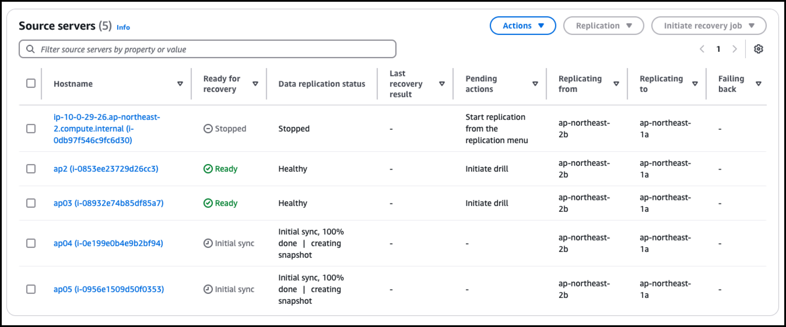
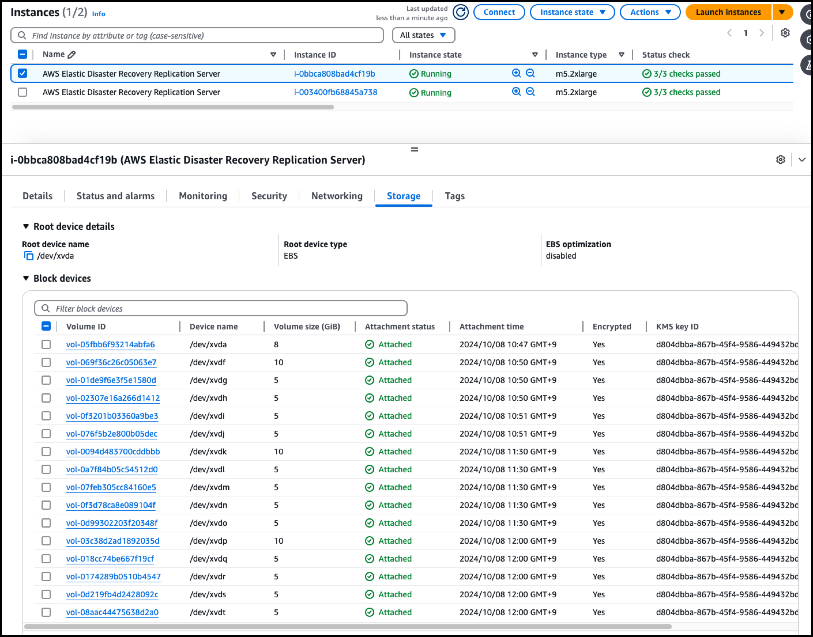
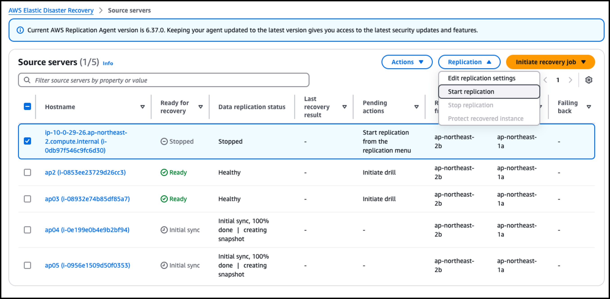
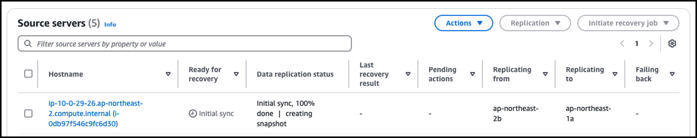
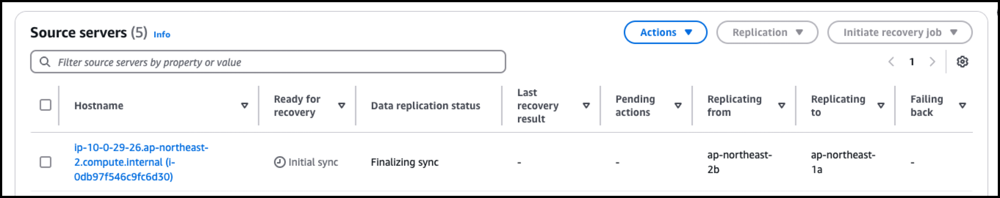
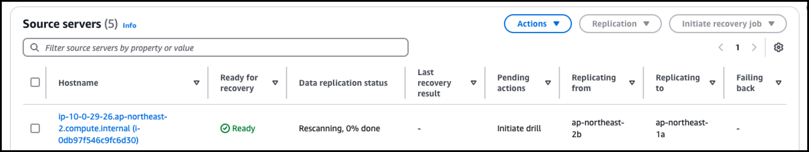
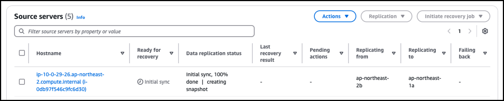
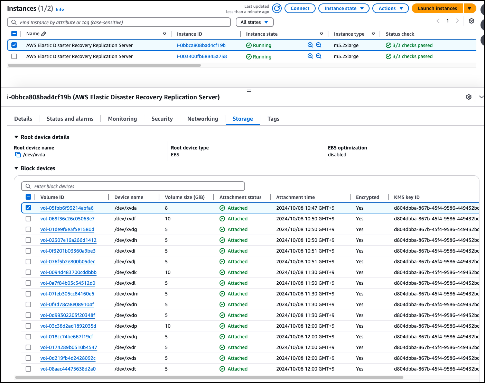

1. Replication => Stop Replication 할 경우




```
sh-4.2$ ps -efa|grep replication
root     27819 31057  0 03:23 ?        00:00:00 sudo /var/lib/aws-replication-agent/nvme_device_mapper --block-dev /dev/nvme4n1
root     27820 27819 22 03:23 ?        00:00:00 /var/lib/aws-replication-agent/nvme_device_mapper --block-dev /dev/nvme4n1
ssm-user 27822 27801  0 03:23 pts/0    00:00:00 grep replication
aws-rep+ 31054     1  0 01:46 ?        00:00:01 /var/lib/aws-replication-agent/tailer -a agent.config -f agent.log.0
aws-rep+ 31055     1  0 01:46 ?        00:00:00 /var/lib/aws-replication-agent/run_linux_migration_scripts_periodically -a agent.config -s
aws-rep+ 31056     1  2 01:46 ?        00:01:57 /var/lib/aws-replication-agent/jre/bin/java -client -Xms88m -Xmx88m -XX:+HeapDumpOnOutOfMemoryError -XX:HeapDumpPath=./client.hprof -classpath External/*:*:. -XX:ErrorFile=./java_error.log -XX:-CreateMinidumpOnCrash -Djava.io.tmpdir=/var/lib/aws-replication-agent/.tmp -Djna.nosys=true com.amazonaws.cloudendure.drs.agent.Main agent.config
aws-rep+ 31057     1  0 01:46 ?        00:00:03 /var/lib/aws-replication-agent/update_onprem_volumes -a agent.config
```





---

2. Start Replication



Start 몇초만에 아래처럼 변경



몇초만에 아래처럼 변경












