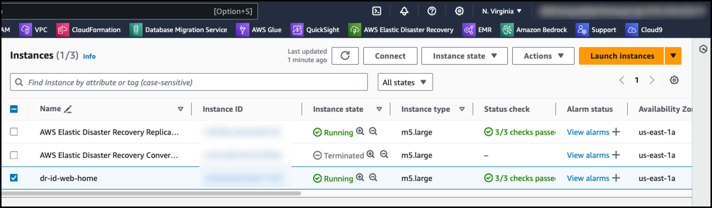

# Scenario 1

## Launch시 DR Site용 /etc/fstab 수정 (Target Launch시 EFS 부분 주석 처리)

**Source EC2에 연결되어 있는 EFS를 Target쪽에서 Failover시 Target EFS로 자동 Mount 여부 확인**

```
Source Region : Oregon us-west-2
Target Region : Virginia us-east-1
```


### 1. EFS 생성 및 Source EC2에 Mount 

### 다음의 변수들을 수정 필요

```
VPC_ID="vpc-0e7536971adbad31f"  # 사용할 VPC의 ID
EFS_NAME="efs-us-east-1-web"   # 생성할 EFS의 이름
REGION="us-east-1"              # 사용할 AWS 리전 (미국 동부)
SECURITY_GROUP_NAME="web-source-security-group" # 보안 그룹 이름
```


```
#!/bin/bash

# 변수 설정
VPC_ID="vpc-037583408fac9602d"
EFS_NAME="efs-us-east-1-web2"
REGION="us-west-2" # 미국 서부(오레곤) 리전
SECURITY_GROUP_NAME="web-source-security-group" # 보안 그룹 이름

# 보안 그룹 ID 가져오기
SECURITY_GROUP_ID=$(aws ec2 describe-security-groups --filters "Name=group-name,Values=$SECURITY_GROUP_NAME" --query "SecurityGroups[0].GroupId" --output text --region $REGION)

if [ -z "$SECURITY_GROUP_ID" ]; then
  echo "보안 그룹 ID를 찾을 수 없습니다!"
  exit 1
fi

echo "Security Group ID: $SECURITY_GROUP_ID"

# 1. Private Subnet ID 가져오기
PRIVATE_SUBNET_IDS=$(aws ec2 describe-subnets --filters "Name=vpc-id,Values=$VPC_ID" "Name=tag:aws:cloudformation:logical-id,Values=PrivateSubnet*" --query "Subnets[].SubnetId" --output text --region $REGION)

if [ -z "$PRIVATE_SUBNET_IDS" ]; then
  echo "Private Subnet을 찾을 수 없습니다!"
  exit 1
fi

echo "Private Subnet IDs: $PRIVATE_SUBNET_IDS"

# 2. EFS 생성
EFS_ID=$(aws efs create-file-system --creation-token $EFS_NAME --tags Key=Name,Value=$EFS_NAME --query "FileSystemId" --output text --region $REGION)

echo "EFS ID: $EFS_ID"

# 3. EFS가 available 상태가 될 때까지 대기
echo "EFS가 available 상태가 될 때까지 대기 중..."
while true; do
  EFS_STATE=$(aws efs describe-file-systems --file-system-id $EFS_ID --query "FileSystems[0].LifeCycleState" --output text --region $REGION)
  if [ "$EFS_STATE" == "available" ]; then
    echo "EFS가 available 상태가 되었습니다."
    break
  fi
  echo "현재 상태: $EFS_STATE. 10초 후 다시 확인합니다."
  sleep 10
done

# 4. 각 Private Subnet에 대해 Mount Target 생성
for SUBNET_ID in $PRIVATE_SUBNET_IDS; do
  echo "Subnet $SUBNET_ID에 Mount Target 생성 중..."
  aws efs create-mount-target --file-system-id $EFS_ID --subnet-id $SUBNET_ID --security-groups $SECURITY_GROUP_ID --region $REGION
done

echo "EFS 생성 및 Mount Target 설정 완료."

# 5. Security Group 수정 (필요한 경우)
# EFS에 접근할 수 있도록 NFS 트래픽을 허용해야 합니다.
aws ec2 authorize-security-group-ingress --group-id $SECURITY_GROUP_ID --protocol tcp --port 2049 --source-group $SECURITY_GROUP_ID --region $REGION

echo "Security Group $SECURITY_GROUP_ID에 NFS 포트(2049) 접근 허용 완료."

# 6. EFS 마운트 명령어 출력
# 생성된 EFS를 마운트할 수 있는 명령어를 출력
echo "EFS를 마운트하려면 다음 명령어를 사용하세요:"
echo "sudo mount -t efs -o tls $EFS_ID:/ /mnt/efs"

# 마운트 포인트 디렉토리 생성 (필요한 경우)
echo "마운트 포인트 디렉토리가 없다면 다음 명령어로 생성하세요:"
echo "sudo mkdir -p /mnt/efs"
```


### 2. EC2에 EFS Util 설치

```
sudo yum install -y amazon-efs-utils
```


### 3. Mount Point 생성 및 Mount Test

```
sudo mkdir -p /mnt/efs3
sudo mount -t efs -o tls fs-0680af52cd2b8bda6:/ /mnt/efs3
df -h /mnt/efs3
Filesystem      Size  Used Avail Use% Mounted on
127.0.0.1:/     8.0E     0  8.0E   0% /mnt/efs3
```


### 4. /etc/fstab 수정 및 Test

```
sh-4.2$ sudo vi /etc/fstab
sh-4.2$ cat /etc/fstab
#
UUID=9f262948-b373-4d6f-b453-2a05174e900c     /           xfs    defaults,noatime  1   1
fs-0680af52cd2b8bda6:/ /mnt/efs3 efs _netdev,tls 0 0

sh-4.2$ sudo umount /mnt/efs3
sh-4.2$ df -h /mnt/efs3
Filesystem      Size  Used Avail Use% Mounted on
/dev/nvme0n1p1  8.0G  2.2G  5.8G  28% /

sh-4.2$ sudo mount /mnt/efs3
sh-4.2$ df -h /mnt/efs3
Filesystem      Size  Used Avail Use% Mounted on
127.0.0.1:/     8.0E     0  8.0E   0% /mnt/efs3
```


### 5. Target 쪽 EFS 생성

### 다음의 변수들을 수정 필요

```
VPC_ID="vpc-01cb2196106db5cf9"  # 사용할 VPC의 ID
EFS_NAME="efs-us-east-1-web2"   # 생성할 EFS의 이름
REGION="us-east-1"              # 사용할 AWS 리전 (미국 동부)
SECURITY_GROUP_NAME="web-target-security-group" # 보안 그룹 이름
```


````
#!/bin/bash

# 변수 설정
VPC_ID="vpc-01cb2196106db5cf9"
EFS_NAME="efs-us-east-1-web2"
REGION="us-east-1" # 미국 서부(오레곤) 리전
SECURITY_GROUP_NAME="web-target-security-group" # 보안 그룹 이름

# 보안 그룹 ID 가져오기
SECURITY_GROUP_ID=$(aws ec2 describe-security-groups --filters "Name=group-name,Values=$SECURITY_GROUP_NAME" --query "SecurityGroups[0].GroupId" --output text --region $REGION)

if [ -z "$SECURITY_GROUP_ID" ]; then
  echo "보안 그룹 ID를 찾을 수 없습니다!"
  exit 1
fi

echo "Security Group ID: $SECURITY_GROUP_ID"

# 1. Private Subnet ID 가져오기
PRIVATE_SUBNET_IDS=$(aws ec2 describe-subnets --filters "Name=vpc-id,Values=$VPC_ID" "Name=tag:aws:cloudformation:logical-id,Values=PrivateSubnet*" --query "Subnets[].SubnetId" --output text --region $REGION)

if [ -z "$PRIVATE_SUBNET_IDS" ]; then
  echo "Private Subnet을 찾을 수 없습니다!"
  exit 1
fi

echo "Private Subnet IDs: $PRIVATE_SUBNET_IDS"

# 2. EFS 생성
EFS_ID=$(aws efs create-file-system --creation-token $EFS_NAME --tags Key=Name,Value=$EFS_NAME --query "FileSystemId" --output text --region $REGION)

echo "EFS ID: $EFS_ID"

# 3. EFS가 available 상태가 될 때까지 대기
echo "EFS가 available 상태가 될 때까지 대기 중..."
while true; do
  EFS_STATE=$(aws efs describe-file-systems --file-system-id $EFS_ID --query "FileSystems[0].LifeCycleState" --output text --region $REGION)
  if [ "$EFS_STATE" == "available" ]; then
    echo "EFS가 available 상태가 되었습니다."
    break
  fi
  echo "현재 상태: $EFS_STATE. 10초 후 다시 확인합니다."
  sleep 10
done

# 4. 각 Private Subnet에 대해 Mount Target 생성
for SUBNET_ID in $PRIVATE_SUBNET_IDS; do
  echo "Subnet $SUBNET_ID에 Mount Target 생성 중..."
  aws efs create-mount-target --file-system-id $EFS_ID --subnet-id $SUBNET_ID --security-groups $SECURITY_GROUP_ID --region $REGION
done

echo "EFS 생성 및 Mount Target 설정 완료."

# 5. Security Group 수정 (필요한 경우)
# EFS에 접근할 수 있도록 NFS 트래픽을 허용해야 합니다.
aws ec2 authorize-security-group-ingress --group-id $SECURITY_GROUP_ID --protocol tcp --port 2049 --source-group $SECURITY_GROUP_ID --region $REGION

echo "Security Group $SECURITY_GROUP_ID에 NFS 포트(2049) 접근 허용 완료."

# 6. EFS 마운트 명령어 출력
# 생성된 EFS를 마운트할 수 있는 명령어를 출력
echo "EFS를 마운트하려면 다음 명령어를 사용하세요:"
echo "sudo mount -t efs -o tls $EFS_ID:/ /mnt/efs"

# 마운트 포인트 디렉토리 생성 (필요한 경우)
echo "마운트 포인트 디렉토리가 없다면 다음 명령어로 생성하세요:"
echo "sudo mkdir -p /mnt/efs"
```


````


```
EFS를 마운트하려면 다음 명령어를 사용하세요:

sudo mount -t efs -o tls fs-043a960ee2abd96f0:/ /mnt/efs
```


### 6. Source EC2의 /boot/post_launch script 생성

```
[root@dr-id-web-home post_launch]# vi efs-commented.sh
[root@dr-id-web-home post_launch]# chmod u+x efs-commented.sh
[root@dr-id-web-home post_launch]# cat efs-commented.sh
sed -i '/^fs-0680af52cd2b8bda6:/ s/^/# /' /etc/fstab
```


### 7. Drill Test

```
#!/bin/bash

# 1. 환경 변수 설정
export REGION="us-east-1"  # 사용할 AWS 리전

# 2. DRS에서 Source Server의 List 확인
echo "DRS에서 소스 서버 목록을 가져오는 중..."
SOURCE_SERVERS=$(aws drs describe-source-servers --region $REGION --query "items[].{SourceServerID:sourceServerID, Hostname:sourceProperties.identificationHints.hostname, InstanceID:sourceProperties.identificationHints.instanceId}" |jq)

if [ -z "$SOURCE_SERVERS" ]; then
  echo "소스 서버를 찾을 수 없습니다!"
  exit 1
fi

echo "소스 서버 목록:"
echo "$SOURCE_SERVERS"

# 3. Source Server ID 입력 받기
read -p "복구할 소스 서버의 Source Server ID를 입력하세요: " SERVER_ID

# 4. Initiate recovery 또는 Initiate recovery Drill 선택
echo "복구 유형을 선택하세요:"
echo "1) Initiate Recovery"
echo "2) Initiate Recovery Drill"
read -p "선택 (1 또는 2): " RECOVERY_TYPE

# 선택에 따라 AWS CLI 명령 실행
case $RECOVERY_TYPE in
  1)
    echo "Initiating Recovery for server $SERVER_ID..."
    aws drs start-recovery --source-servers "sourceServerID=$SERVER_ID" --region $REGION --no-is-drill
    ;;
  2)
    echo "Initiating Recovery Drill for server $SERVER_ID..."
    aws drs start-recovery --source-servers "sourceServerID=$SERVER_ID" --region $REGION --is-drill
    ;;
  *)
    echo "잘못된 선택입니다. 스크립트를 종료합니다."
    exit 1
    ;;
esac


echo "작업이 완료되었습니다."
```


### 8. Drill 결과 확인 (post launch 성공)




```
sh-4.2$ df -h
Filesystem      Size  Used Avail Use% Mounted on
devtmpfs        3.8G     0  3.8G   0% /dev
tmpfs           3.8G     0  3.8G   0% /dev/shm
tmpfs           3.8G  332K  3.8G   1% /run
tmpfs           3.8G     0  3.8G   0% /sys/fs/cgroup
/dev/nvme0n1p1  8.0G  2.3G  5.8G  28% /
sh-4.2$ cd /boot/post_launch/
sh-4.2$ ls -alrt
total 12
-rwxr-xr-x 1 root root 2541 Sep  7 08:37 post_launch_script.sh
-rwxr--r-- 1 root root   53 Sep  8 14:35 efs-commented.sh
drwxr-xr-x 2 root root   59 Sep  8 14:35 .
dr-xr-xr-x 6 root root 4096 Sep  8 15:12 ..
sh-4.2$ uptime
 15:15:17 up 2 min,  0 users,  load average: 0.07, 0.05, 0.01
sh-4.2$ cat /etc/fstab
#
UUID=9f262948-b373-4d6f-b453-2a05174e900c       /       xfs     defaults,noatime        0       0
# fs-0680af52cd2b8bda6:/        /mnt/efs3       efs     _netdev,tls     0       0
sh-4.2$
```


**Drill 시 정상적으로 Target Region에서 Instance 가 올라옴을 확인**


---

---


# Scenario 2

## Target으로 Failover시 Target Region의 EFS가 자동으로 Mount되는 것 Test

**Source EC2에 연결되어 있는 EFS를 Target쪽에서 Failover시 Target EFS로 자동 Mount 여부 확인**


### 1. Target Region EFS 확인

```
sudo mount -t efs -o tls fs-043a960ee2abd96f0:/ efs
```


### 2. Source EC2 확인

```
[root@dr-id-web-home post_launch]# cat /etc/fstab
#
UUID=9f262948-b373-4d6f-b453-2a05174e900c     /           xfs    defaults,noatime  1   1
fs-0680af52cd2b8bda6:/ /mnt/efs3 efs _netdev,tls 0 0

[root@dr-id-web-home post_launch]# df  -h /mnt/efs3/
Filesystem      Size  Used Avail Use% Mounted on
127.0.0.1:/     8.0E     0  8.0E   0% /mnt/efs3

[root@dr-id-web-home post_launch]# cat efs-commented.sh
sudo sed -i 's/fs-043a960ee2abd96f0/fs-043a960ee2abd96f0/g' /etc/fstab
```


```
sh-4.2$ cat /etc/fstab
#
UUID=9f262948-b373-4d6f-b453-2a05174e900c       /       xfs     defaults,noatime        0       0
fs-0680af52cd2b8bda6:/  /mnt/efs3       efs     _netdev,tls     0       0
sh-4.2$ df -h /mnt/efs3
Filesystem      Size  Used Avail Use% Mounted on
/dev/nvme0n1p1  8.0G  2.3G  5.8G  28% /
```


sh-4.2$ df -h /mnt/efs3/
Filesystem      Size  Used Avail Use% Mounted on
/dev/nvme0n1p1  8.0G  2.3G  5.8G  28% /


