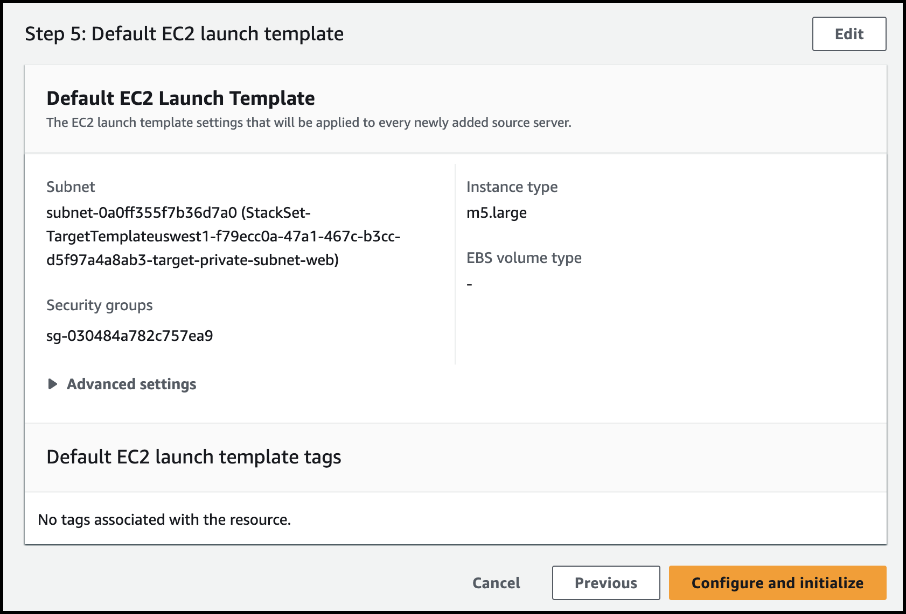

# Module 1 - Environment Setup

### Module Overview

```
Configuring DRS service in DR Region
Configuring required IAM Permissions
Tag the target EC2 Instances
Installing the DRS Replication agent
Configuring Launch Templates
```


---

### Configuring DRS Settings in DR Region


1. [여기](https://us-west-1.console.aws.amazon.com/drs/home?region=us-west-1#/welcome) 를 새 창(새 탭)으로 띄워서 **DRS(AWS Elastic Disaster Recovery)** Console로 이동합니다. (**Region : N. California**)

   **Configure and initialize** 를 클릭합니다.


---

2. **Set up replication servers** 에서 아래와  같이 정보를 입력 후 **Next**.

```
Staging area subnet : DRS Staging
Replication server instance type : m5.large
```


---

3. **Specify volumes and security groups**에서 **Default** 값 그대로 두고 **Next**


---

4. **Configure additional replication settings** 에서 **Default** 값으로 두고 **Next**


---

5. **Set default DRS launch settings**에서 아래와 같이 입력 후 **Next**

```
Instance type right-sizing : Inactive

Start Instance upon launch : Check
Transfer server tags : Check

OS licensing : Use AWS provided license
```


---

7. ***Set default EC2 launch template***에서 아래와 같이 입력 후 **Next**

```
Subnet: Select the subnet that ends with "-target-private-subnet-web"
Security groups: Select the "web-target-security-group".
Instance Type: "m5.large"
EBS volume type: Leave it to default
```


---

8. **Review and initialize** 에서 **Configure and Initialize**를 클릭합니다.




---

9. 아래처럼 성공 메시지를 확인합니다.


