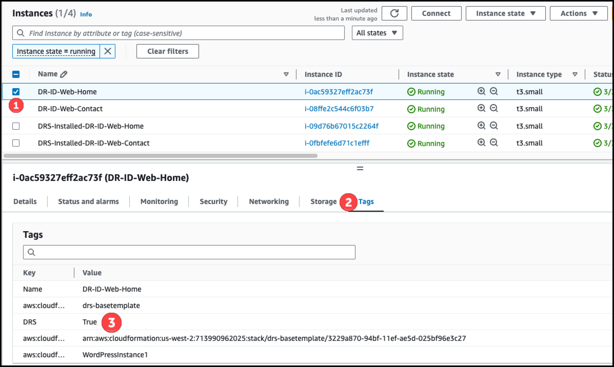
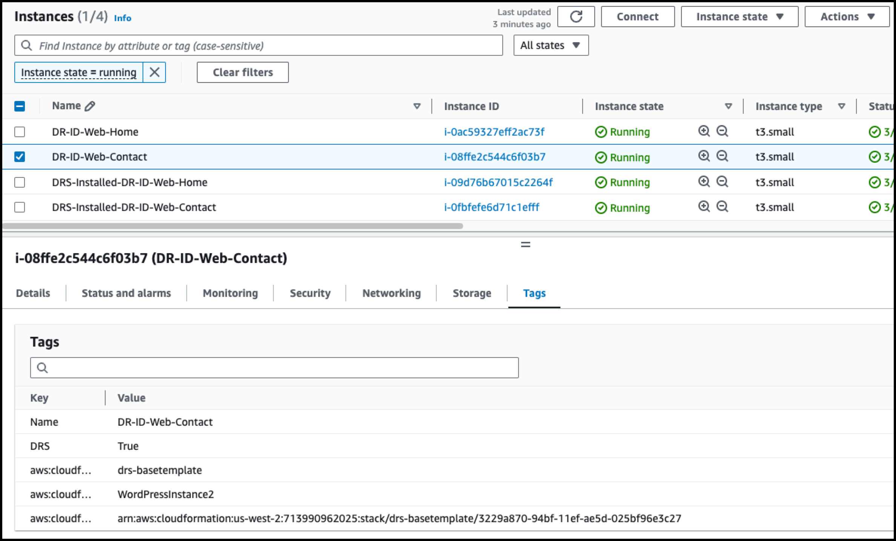

# Module 2 - Configure IAM Role & Tag Resources


## Configure IAM Role

1. [여기](https://us-east-1.console.aws.amazon.com/iamv2/home?region=us-west-1#/roles) 를 새 창(새 탭)으로 띄워서 **IAM** Console로 이동합니다


---


2. 아래 Role 이름을 복사하여, 검색합니다.

   ```
   drs-basetemplate-DRIDRole
   ```


---

3. **Permissions** => **Add Permission** => **Attach policies** 를 클릭합니다.


---

4. 아래 Policy 이름을 검색하고, 체크 후 **Add permissions**을 클릭합니다.

```
AWSElasticDisasterRecoveryEc2InstancePolicy
```


---

5. 아래처럼 Permission 추가를 확인합니다.


---


## Tag Resources

1. [여기](https://us-west-2.console.aws.amazon.com/ec2/home?region=us-west-2#Instances:instanceState=running) 를 새 창(새 탭)으로 띄워서 **EC2 Console** 메뉴로 이동합니다.


---

2. **DR-ID-Web-Home** 인스턴스를 **체크(선택)** 후, **Tags** Tab으로 이동, **DRS=True** Tag를 확인합니다.

   ::alert[System Manager를 사용하여 Agent 설치 시, DRS=True인 인스턴스를 대상으로 지정합니다.]{header="DRS Agent 설치 대상" type="warning"}




---

3. **DR-ID-Web-Contact** 인스턴스를 **체크(선택)** 후, **Tags** Tab으로 이동, **DRS=True** Tag를 확인합니다.




---


