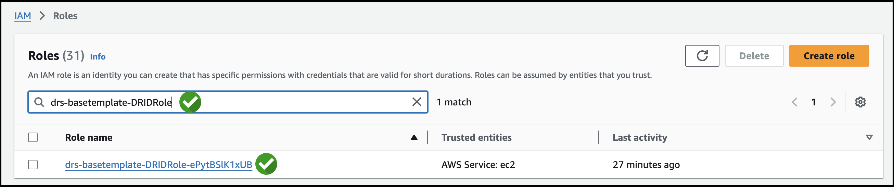
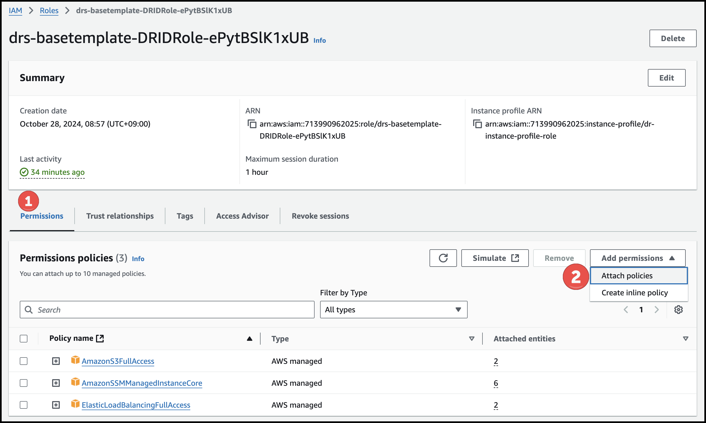
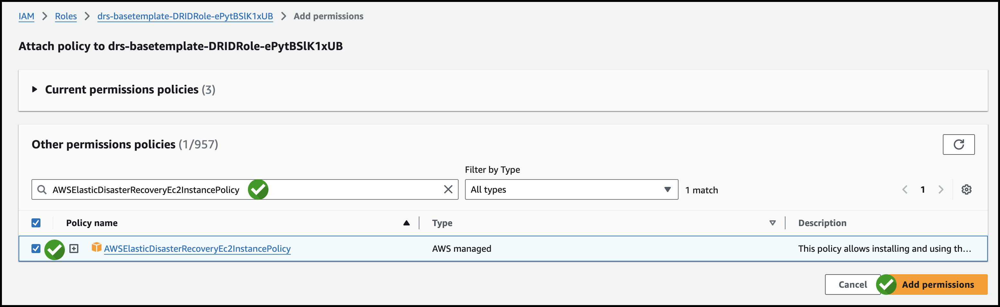
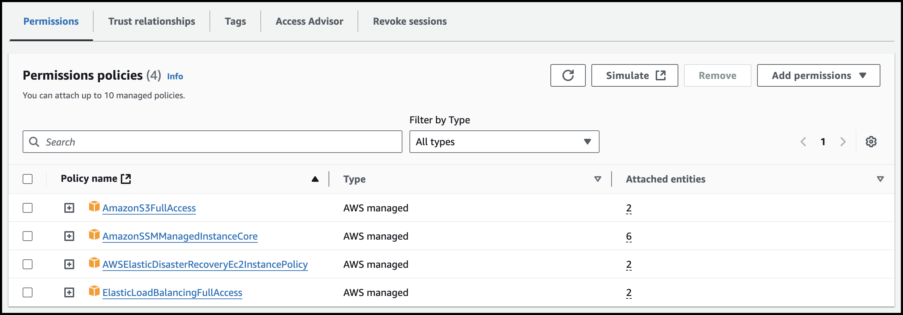

# Module 2 - Configure IAM Role


1. [여기](https://us-east-1.console.aws.amazon.com/iamv2/home?region=us-west-1#/roles) 를 새 창(새 탭)으로 띄워서 **IAM** Console로 이동합니다


---


2. 아래 Role 이름을 복사하여, 검색합니다.

   ```
   drs-basetemplate-DRIDRole
   ```




---

3. **Permissions** => **Add Permission** => **Attach policies** 를 클릭합니다.




---

4. 아래 Policy 이름을 검색하고, 체크 후 **Add permissions**을 클릭합니다.

```
AWSElasticDisasterRecoveryEc2InstancePolicy
```




---

5. 아래처럼 Permission 추가를 확인합니다.




---


