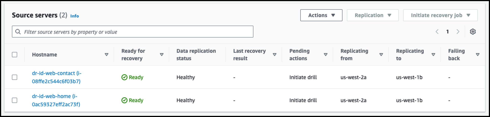
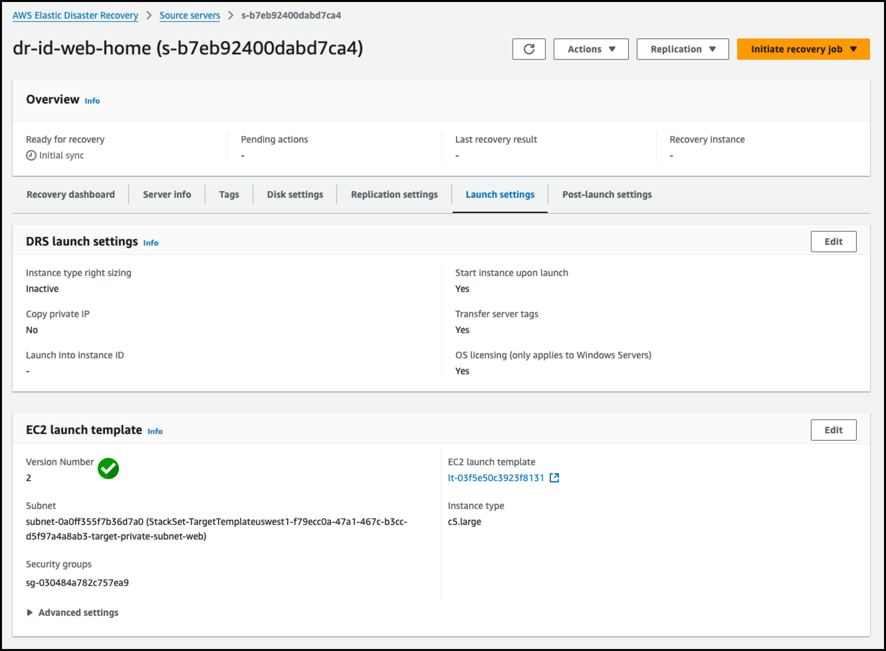

# Module 3 - Installing the Agent & Configure Launch Settings


## Installing the Agent


1. [여기](https://us-west-2.console.aws.amazon.com/systems-manager/run-command/executing-commands?region=us-west-2) 를 새 창(새 탭)으로 띄워서 **System Manager Console** 메뉴로 이동합니다.  (**확인!! Source Region : Oregon**)


---

2. 화면 좌측의 **Run command**  메뉴를 클릭 후, **Run command** 버튼을 클릭 합니다.


---

3. 아래 **AWSDisasterRecovery**를 검색하면 **AWSDisasterRecovery-InstallDRAgentOnInstance**가 검색 되면 선택 합니다.

```
AWSDisasterRecovery
```


---

4. 설정 화면에서 아래처럼 설정합니다.

```
Document Version : 기본값 유지
```


**Command parameters**

```
Region : us-west-1
```


**Target Selection**

```
Tag Key : DRS
Tag value(optional) : True

위의 값 입력 후 ADD 클릭
```


**Output options**

```
Enable an s3 bucket : Uncheck
```


---

5. Run Command를 이용하여 2개의 인스턴스에 DRS Agent 설치가 시작됩니다. (Agent  설치는 5~10분정도 필요합니다.)


---

6. [여기](https://us-west-1.console.aws.amazon.com/drs/home?region=us-west-1#/sourceServers) 를 새 창(새 탭)으로 띄워서 **TARGET REGION(us-west-1)의 DRS Page** 로 가보면 Initial Sync가 되고 있음을 알 수 있습니다.

   ::alert[초기 복제에는 시간이 좀 필요합니다. 복제가 끝날때까지 기다리지 말고 다음 스텝을 진행합니다.]{header="초기 복제" type="warning"}
   
   (**확인!! Target Region : N. California**)


```
Create security groups
Launch replication server
Boot replication server
Authenticate with service
Download replication software
Create staging disks
Attach staging disks
Pair replication server with Agent
Connect agent with replication server
Start data transfer
```


**%참고%** **정상적으로 동기화 되면 아래처럼 보입니다**




---

## Configure Launch Settings

1. [여기](https://us-west-1.console.aws.amazon.com/drs/home?region=us-west-1#/sourceServers) 를 새 창(새 탭)으로 띄워서 **Target REGION N. California** 의 **DRS Console - Source Servers**로 이동합니다.

   **dr-id-web-home** 을 클릭하여 설정을 확인합니다.  (**확인!! Target Region : N. California**)


---

2. **EC2 launch template** 에서 **Edit**를 클릭합니다.


---

3. 기존의 **m5.large에서** **c5.large**로 변경 후 **Update template**를 클릭합니다.

   ::alert[DR Failover 상황에서 Target Instance의 Instance Type의 종류를 여기에서 결정합니다.]{header="Launch Template" type="warning"}


---

4. **Version Number**가 숫자가 증가하는 것을 알 수 있습니다.




---

5. **dr-id-web-contact**도 동일하게 변경합니다.


---

6. 


