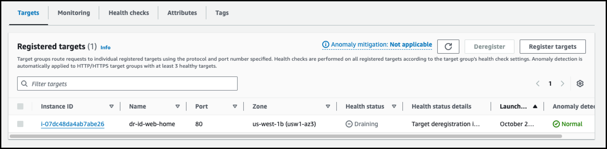

# Module 4 - Failover Replication to AWS DR Region

### Architecture Diagram


```
Overview of the current setup
Monitoring Replication
Failover Prerequsites (understanding Post launch scripts)
Failing over and validating failover was successful

```


## Review Application and Simulate Data Writes

**Source Region에서 기존에 서비스 하고 있는 Web Service에 접속하여 상태를 확인 해보겠습니다.**

1. [여기](https://us-west-2.console.aws.amazon.com/ec2/home?region=us-west-2#LoadBalancers:) 를 새 창(새 탭)으로 띄워서  **Source region us-west-2**의 **ELB Console**로 이동합니다.

   Load Balancer의 **DNS Name**을 복사합니다. 


---

2. 브라우저의 새로운 탭에서 해당 DNS Name을 붙여 넣고 이동하여 아래와 같은 화면이 나오는지 확인합니다.


---

3. **DR-ID-Web-Home** 에 접속하여 Web Page를 수정해보겠습니다. 

   [여기](https://us-west-2.console.aws.amazon.com/ec2/home?region=us-west-2#Instances:instanceState=running) 를 새 창(새 탭)으로 띄우고, **DR-ID-Web-Home**을 선택 후 **Connect**를 클릭합니다.

   새로운 창이 뜨면 **Session Manager** Tab을 선택 후 **Connect**를 누릅니다.


---

4. **DR-ID-Web-Home** 인스턴스에 정상적으로 접속이 되면, 아래 명령어를 복사하여 실행합니다.

```
sudo sed -i 's/<!--Add here-->/<h1> I just made a change to the Home page of my website<\/h1>/g' /var/www/html/index.html
```


---

5. 아까 연결해둔 Web Page에서 새로 고침을 실행해서 아래와 같이 변경되었는지 확인합니다.


---


## Simulate a DR Event

1. 가상의 DR 상황을 가정하고, **Source Region**의 인스턴스들을 모두 중지하겠습니다.

   [여기](https://us-west-2.console.aws.amazon.com/ec2/home?region=us-west-2#Instances:instanceState=running) 를 새 창(새 탭)으로 띄우고, **DR-ID-Web-Home과 DR-ID-Web-Contact**를 도 선택 후, 마우스 우측 버튼을 누르고 **Stop Instance**를 합니다.


---

2. 아까 연결해둔 Web Page에서 새로 고침을 실행해서 상태를 확인합니다. 서버가 모두 장애 상황이기 때문에 에러가 발생합니다.


---

## Failover 수행

1. [여기](https://us-west-1.console.aws.amazon.com/drs/home?region=us-west-1#/sourceServers) 를 새 창(새 탭)으로 띄워서, **Target Region(us-west-1)의 DRS Console**로 이동합니다.


---

2. **dr-id-web-home, dr-id-web-contact**을 모두 선택 후, **Initiate recovery**를 선택 합니다.

   **Source Server아 장애 상황이기 때문에 Lag Time이 증가하고 있습니다.**


---

3. **Use most recent data**를 선택 후 **Initiate recovery**를 선택합니다.


---

4. 복구 상황을 보기 위해서 **Recovery job history**로 이동해서 모니터링합니다.

   [여기](https://us-west-1.console.aws.amazon.com/drs/home?region=us-west-1#/launchHistory) 를 새 창(새 탭)으로 띄워서 **Job status**를 확인합니다.


---

5. 10분 정도가 지나고 **Target Region(us-west-1)**에서 **DR Recovery**가 완료된 것을 확인합니다.


---

6. **Target Region**에 인스턴스가 복구가 되었는지 확인합니다.

   [여기](https://us-west-1.console.aws.amazon.com/ec2/home?region=us-west-1#Instances:instanceState=running) 를 새 창(새 탭)으로 띄워서 복구된 인스턴스가 동작중인지 확인합니다.


---

## Validating Failover

1. [여기](https://us-west-1.console.aws.amazon.com/ec2/home?region=us-west-1#TargetGroups:) 를 새 창(새 탭)으로 띄워서 **Target Region(N. California) ELB Console**로 이동합니다. 

   **my-target-group-home** 을 클릭합니다.


---

3. **Register targets** 를 클릭합니다.




---

4. **DR Failover**로 만들어진 인스턴스 중 **dr-id-web-home**을 선택 후  **Include as Pending below**를 클릭합니다.


---

5. **Review Targets**에 아래처럼 인스턴스가 보이면 **Register pending targets**을 클릭합니다.


---

5. 잠시 기다리면 타겟의 상태가 **Healthy**로 변경됩니다.


---

6. [여기](https://us-west-1.console.aws.amazon.com/ec2/home?region=us-west-1#LoadBalancers:) 를 새 창(새 탭)으로 띄우고, **DNS Name**을 복사하고, 브라우저에서 접속합니다.

   DNS 등록 시간때문에 접속이 되지 않을 경우, 잠시 기다렸다가 실행합니다.


---

7. 화면처럼 아까 변경된 페이지가 DR Target Site에서 정상적으로 구동 되는 것을 확인 할 수 있습니다.


